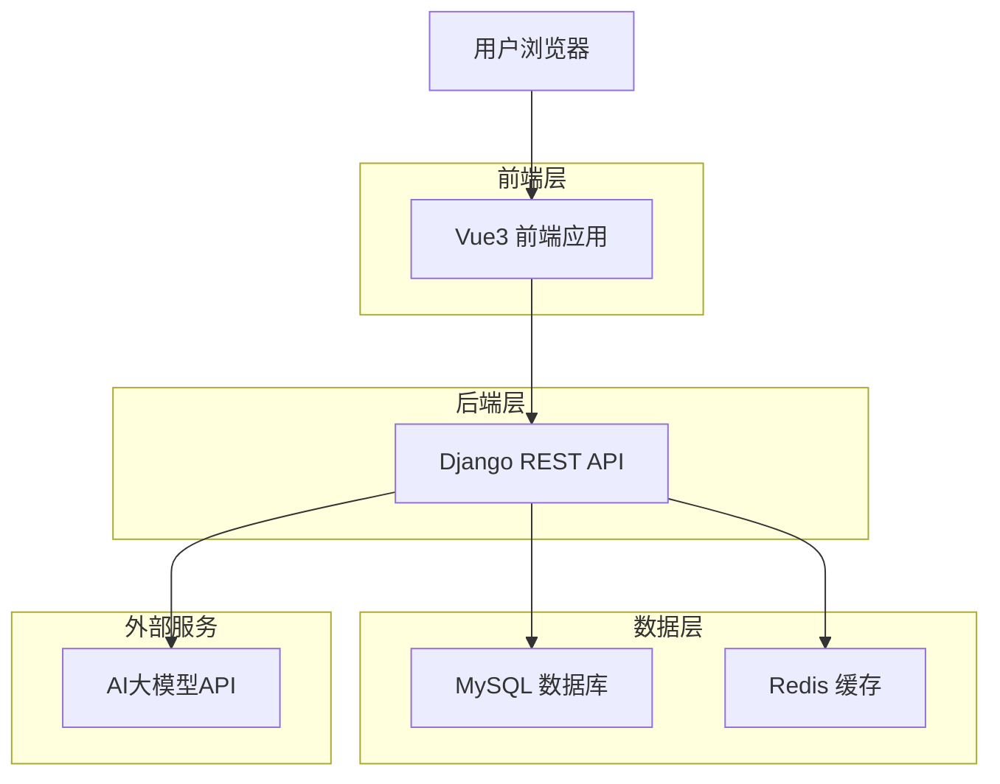
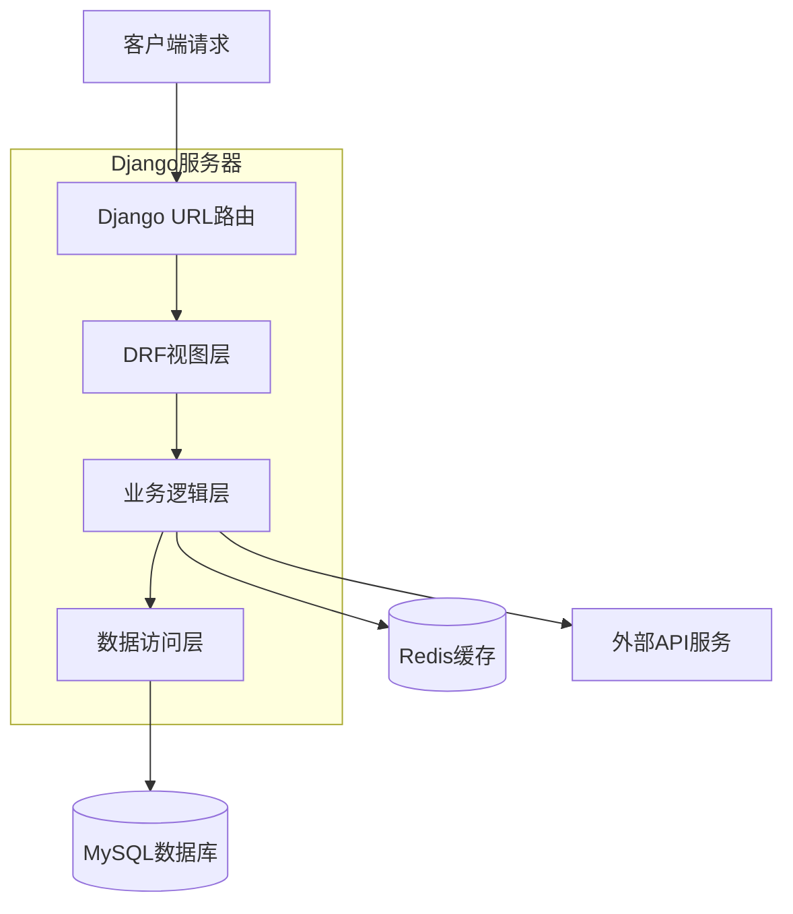
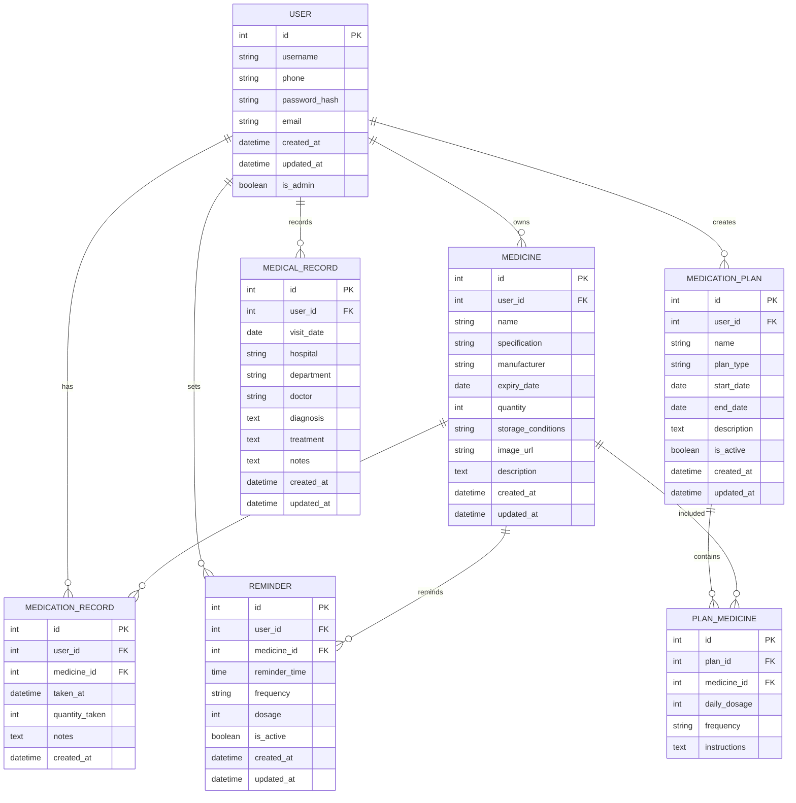

# MTM-Helper 药品管理系统技术架构文档

## 1. 架构设计



## 2. 技术描述

- **前端**: Vue3@3.4+ + TypeScript@5.0+ + Vite@5.0+ + Vue Router@4.0+ + Pinia@2.0+
- **后端**: Django@4.2+ + Django REST Framework@3.14+ + Django CORS Headers
- **数据库**: MySQL@8.0+ (主数据库) + Redis@7.0+ (缓存和会话)
- **部署**: Docker + Docker Compose

## 3. 路由定义

| 路由 | 用途 |
|------|------|
| / | 欢迎页面，展示品牌logo和登录注册入口 |
| /login | 登录页面，用户身份验证 |
| /register | 注册页面，新用户注册 |
| /dashboard | 主导航页面，功能模块导航中心 |
| /medicines | 药品管理页面，药品列表和管理功能 |
| /medicines/add | 新增药品页面，添加药品信息 |
| /medicines/:id | 药品详情页面，查看和编辑药品信息 |
| /records | 用药记录页面，查看服药历史和统计 |
| /reminders | 用药提醒页面，设置和管理提醒 |
| /plans | 用药计划页面，制定和管理用药方案 |
| /medical-records | 就医记录页面，记录就诊信息 |
| /admin | 后台管理页面，管理员专用 |
| /profile | 个人设置页面，用户信息和偏好设置 |

## 4. API定义

### 4.1 核心API

**用户认证相关**
```
POST /api/auth/register/
```

请求参数:
| 参数名 | 参数类型 | 是否必需 | 描述 |
|--------|----------|----------|------|
| username | string | true | 用户名 |
| phone | string | true | 手机号 |
| password | string | true | 密码 |
| verification_code | string | true | 验证码 |

响应参数:
| 参数名 | 参数类型 | 描述 |
|--------|----------|------|
| success | boolean | 注册是否成功 |
| data | object | 用户信息 |
| message | string | 响应消息 |

示例:
```json
{
  "username": "张三",
  "phone": "13800138000",
  "password": "password123",
  "verification_code": "123456"
}
```

**药品管理相关**
```
GET /api/medicines/
POST /api/medicines/
PUT /api/medicines/{id}/
DELETE /api/medicines/{id}/
```

**用药记录相关**
```
GET /api/medication-records/
POST /api/medication-records/
```

**用药提醒相关**
```
GET /api/reminders/
POST /api/reminders/
PUT /api/reminders/{id}/
```

**用药计划相关**
```
GET /api/medication-plans/
POST /api/medication-plans/
```

**就医记录相关**
```
GET /api/medical-records/
POST /api/medical-records/
```

**AI搜索相关**
```
POST /api/medicines/search/
```

## 5. 服务器架构图



## 6. 数据模型

### 6.1 数据模型定义



### 6.2 数据定义语言

**用户表 (users)**
```sql
-- 创建用户表
CREATE TABLE users (
    id INT AUTO_INCREMENT PRIMARY KEY,
    username VARCHAR(50) UNIQUE NOT NULL,
    phone VARCHAR(20) UNIQUE NOT NULL,
    password_hash VARCHAR(255) NOT NULL,
    email VARCHAR(100),
    is_admin BOOLEAN DEFAULT FALSE,
    created_at TIMESTAMP DEFAULT CURRENT_TIMESTAMP,
    updated_at TIMESTAMP DEFAULT CURRENT_TIMESTAMP ON UPDATE CURRENT_TIMESTAMP
);

-- 创建索引
CREATE INDEX idx_users_phone ON users(phone);
CREATE INDEX idx_users_username ON users(username);
```

**药品表 (medicines)**
```sql
-- 创建药品表
CREATE TABLE medicines (
    id INT AUTO_INCREMENT PRIMARY KEY,
    user_id INT NOT NULL,
    name VARCHAR(100) NOT NULL,
    specification VARCHAR(100),
    manufacturer VARCHAR(100),
    expiry_date DATE,
    quantity INT DEFAULT 0,
    storage_conditions TEXT,
    image_url VARCHAR(255),
    description TEXT,
    created_at TIMESTAMP DEFAULT CURRENT_TIMESTAMP,
    updated_at TIMESTAMP DEFAULT CURRENT_TIMESTAMP ON UPDATE CURRENT_TIMESTAMP,
    FOREIGN KEY (user_id) REFERENCES users(id) ON DELETE CASCADE
);

-- 创建索引
CREATE INDEX idx_medicines_user_id ON medicines(user_id);
CREATE INDEX idx_medicines_expiry_date ON medicines(expiry_date);
CREATE INDEX idx_medicines_name ON medicines(name);
```

**用药记录表 (medication_records)**
```sql
-- 创建用药记录表
CREATE TABLE medication_records (
    id INT AUTO_INCREMENT PRIMARY KEY,
    user_id INT NOT NULL,
    medicine_id INT NOT NULL,
    taken_at TIMESTAMP NOT NULL,
    quantity_taken INT NOT NULL,
    notes TEXT,
    created_at TIMESTAMP DEFAULT CURRENT_TIMESTAMP,
    FOREIGN KEY (user_id) REFERENCES users(id) ON DELETE CASCADE,
    FOREIGN KEY (medicine_id) REFERENCES medicines(id) ON DELETE CASCADE
);

-- 创建索引
CREATE INDEX idx_medication_records_user_id ON medication_records(user_id);
CREATE INDEX idx_medication_records_taken_at ON medication_records(taken_at DESC);
```

**用药提醒表 (reminders)**
```sql
-- 创建用药提醒表
CREATE TABLE reminders (
    id INT AUTO_INCREMENT PRIMARY KEY,
    user_id INT NOT NULL,
    medicine_id INT NOT NULL,
    reminder_time TIME NOT NULL,
    frequency VARCHAR(20) NOT NULL,
    dosage INT NOT NULL,
    is_active BOOLEAN DEFAULT TRUE,
    created_at TIMESTAMP DEFAULT CURRENT_TIMESTAMP,
    updated_at TIMESTAMP DEFAULT CURRENT_TIMESTAMP ON UPDATE CURRENT_TIMESTAMP,
    FOREIGN KEY (user_id) REFERENCES users(id) ON DELETE CASCADE,
    FOREIGN KEY (medicine_id) REFERENCES medicines(id) ON DELETE CASCADE
);

-- 创建索引
CREATE INDEX idx_reminders_user_id ON reminders(user_id);
CREATE INDEX idx_reminders_is_active ON reminders(is_active);
```

**用药计划表 (medication_plans)**
```sql
-- 创建用药计划表
CREATE TABLE medication_plans (
    id INT AUTO_INCREMENT PRIMARY KEY,
    user_id INT NOT NULL,
    name VARCHAR(100) NOT NULL,
    plan_type ENUM('long_term', 'short_term') NOT NULL,
    start_date DATE NOT NULL,
    end_date DATE,
    description TEXT,
    is_active BOOLEAN DEFAULT TRUE,
    created_at TIMESTAMP DEFAULT CURRENT_TIMESTAMP,
    updated_at TIMESTAMP DEFAULT CURRENT_TIMESTAMP ON UPDATE CURRENT_TIMESTAMP,
    FOREIGN KEY (user_id) REFERENCES users(id) ON DELETE CASCADE
);

-- 创建索引
CREATE INDEX idx_medication_plans_user_id ON medication_plans(user_id);
CREATE INDEX idx_medication_plans_type ON medication_plans(plan_type);
```

**计划药品关联表 (plan_medicines)**
```sql
-- 创建计划药品关联表
CREATE TABLE plan_medicines (
    id INT AUTO_INCREMENT PRIMARY KEY,
    plan_id INT NOT NULL,
    medicine_id INT NOT NULL,
    daily_dosage INT NOT NULL,
    frequency VARCHAR(50) NOT NULL,
    instructions TEXT,
    FOREIGN KEY (plan_id) REFERENCES medication_plans(id) ON DELETE CASCADE,
    FOREIGN KEY (medicine_id) REFERENCES medicines(id) ON DELETE CASCADE
);

-- 创建索引
CREATE INDEX idx_plan_medicines_plan_id ON plan_medicines(plan_id);
CREATE INDEX idx_plan_medicines_medicine_id ON plan_medicines(medicine_id);
```

**就医记录表 (medical_records)**
```sql
-- 创建就医记录表
CREATE TABLE medical_records (
    id INT AUTO_INCREMENT PRIMARY KEY,
    user_id INT NOT NULL,
    visit_date DATE NOT NULL,
    hospital VARCHAR(100) NOT NULL,
    department VARCHAR(50),
    doctor VARCHAR(50),
    diagnosis TEXT,
    treatment TEXT,
    notes TEXT,
    created_at TIMESTAMP DEFAULT CURRENT_TIMESTAMP,
    updated_at TIMESTAMP DEFAULT CURRENT_TIMESTAMP ON UPDATE CURRENT_TIMESTAMP,
    FOREIGN KEY (user_id) REFERENCES users(id) ON DELETE CASCADE
);

-- 创建索引
CREATE INDEX idx_medical_records_user_id ON medical_records(user_id);
CREATE INDEX idx_medical_records_visit_date ON medical_records(visit_date DESC);
```

**初始化数据**
```sql
-- 插入管理员用户
INSERT INTO users (username, phone, password_hash, email, is_admin) VALUES 
('admin', '13800000000', 'hashed_password_here', 'admin@mtm-helper.com', TRUE);

-- 插入示例药品数据
INSERT INTO medicines (user_id, name, specification, manufacturer, expiry_date, quantity, storage_conditions) VALUES 
(1, '阿司匹林肠溶片', '100mg*30片', '拜耳医药', '2025-12-31', 30, '阴凉干燥处保存'),
(1, '降压药', '5mg*28片', '诺华制药', '2025-06-30', 28, '室温保存，避光');
```