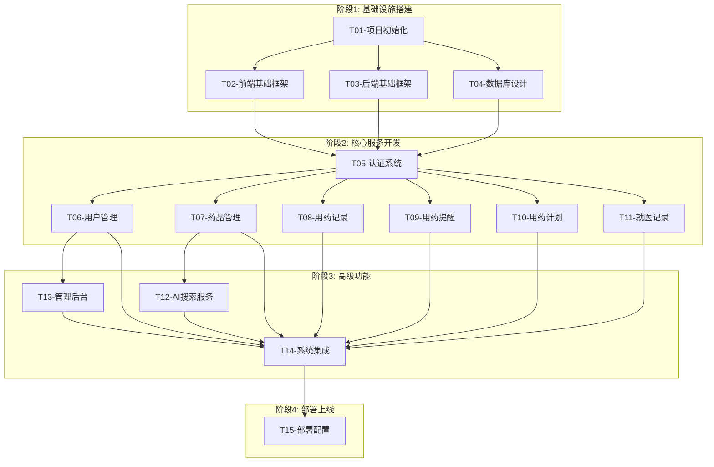

# MTM-Helper 系统开发任务拆分文档

## 1. 任务拆分概述

基于DESIGN架构设计文档，将MTM-Helper系统开发拆分为15个原子任务，按照前端基础设施、后端基础设施、核心业务功能、集成测试的顺序进行开发。每个任务都具有明确的输入输出契约、实现约束和依赖关系。

## 2. 任务依赖关系图

## 3. 原子任务详细定义

### T01 - 项目初始化

**任务描述**: 创建项目目录结构，配置开发环境和基础工具链

**输入契约**:
- 前置依赖: 无
- 输入数据: 项目需求文档、技术架构文档
- 环境依赖: Node.js 22+, Python 3.11+, MySQL 8.0+, Redis 7.0+

**输出契约**:
- 输出数据: 项目目录结构、配置文件
- 交付物: 
  - 前端项目结构 (Vue3 + TypeScript + Vite)
  - 后端项目结构 (Django + DRF)
  - Docker配置文件
  - README.md文档
- 验收标准: 
  - 项目可以正常启动
  - 开发环境配置完成
  - 代码规范工具配置完成

**实现约束**:
- 技术栈: Vue3, TypeScript, Vite, Django, DRF
- 接口规范: RESTful API
- 质量要求: 代码规范检查通过，项目结构清晰

**依赖关系**:
- 后置任务: T02, T03, T04
- 并行任务: 无

---

### T02 - 前端基础框架

**任务描述**: 搭建Vue3前端基础框架，包括路由、状态管理、UI组件库

**输入契约**:
- 前置依赖: T01完成
- 输入数据: 前端架构设计、路由定义
- 环境依赖: Node.js环境，项目初始化完成

**输出契约**:
- 输出数据: 前端基础框架代码
- 交付物:
  - Vue Router 4路由配置
  - Pinia状态管理配置
  - TailwindCSS样式配置
  - 基础布局组件
  - API客户端封装
  - 认证守卫
- 验收标准:
  - 前端项目可以正常启动
  - 路由跳转正常
  - 状态管理功能正常
  - 样式系统工作正常

**实现约束**:
- 技术栈: Vue3, TypeScript, Vue Router 4, Pinia, TailwindCSS
- 接口规范: 组件化开发，TypeScript类型安全
- 质量要求: ESLint检查通过，组件可复用

**依赖关系**:
- 后置任务: T05
- 并行任务: T03, T04

---

### T03 - 后端基础框架

**任务描述**: 搭建Django后端基础框架，包括项目配置、中间件、基础服务

**输入契约**:
- 前置依赖: T01完成
- 输入数据: 后端架构设计、API接口定义
- 环境依赖: Python环境，数据库连接

**输出契约**:
- 输出数据: 后端基础框架代码
- 交付物:
  - Django项目配置
  - DRF配置
  - CORS中间件配置
  - 认证中间件
  - 缓存中间件
  - 日志配置
  - 异常处理器
- 验收标准:
  - 后端服务可以正常启动
  - API接口可以正常访问
  - 中间件功能正常
  - 日志记录正常

**实现约束**:
- 技术栈: Django 4.2+, DRF 3.14+, Redis, MySQL
- 接口规范: RESTful API，统一响应格式
- 质量要求: 代码规范，异常处理完善

**依赖关系**:
- 后置任务: T05
- 并行任务: T02, T04

---

### T04 - 数据库设计

**任务描述**: 创建数据库表结构，配置数据模型和初始数据

**输入契约**:
- 前置依赖: T01完成
- 输入数据: 数据模型设计、DDL语句
- 环境依赖: MySQL数据库，Redis缓存

**输出契约**:
- 输出数据: 数据库表结构、Django模型
- 交付物:
  - MySQL数据库表
  - Django模型定义
  - 数据库迁移文件
  - 初始数据脚本
  - 索引优化
- 验收标准:
  - 数据库表创建成功
  - Django模型可以正常操作
  - 数据迁移正常
  - 初始数据加载成功

**实现约束**:
- 技术栈: MySQL 8.0+, Django ORM
- 接口规范: 数据模型规范，外键关系清晰
- 质量要求: 数据完整性约束，性能优化

**依赖关系**:
- 后置任务: T05
- 并行任务: T02, T03

---

### T05 - 认证系统

**任务描述**: 实现用户认证系统，包括注册、登录、JWT令牌管理

**输入契约**:
- 前置依赖: T02, T03, T04完成
- 输入数据: 认证流程设计、安全策略
- 环境依赖: 前后端框架就绪，数据库连接正常

**输出契约**:
- 输出数据: 认证系统代码
- 交付物:
  - 用户注册API
  - 用户登录API
  - JWT令牌生成和验证
  - 短信验证码服务
  - 前端登录页面
  - 前端注册页面
  - 认证状态管理
- 验收标准:
  - 用户可以正常注册
  - 用户可以正常登录
  - JWT令牌验证正常
  - 短信验证码发送正常
  - 前端认证流程完整

**实现约束**:
- 技术栈: Django JWT, Vue3认证组件
- 接口规范: JWT标准，安全传输
- 质量要求: 安全性高，用户体验好

**依赖关系**:
- 后置任务: T06, T07, T08, T09, T10, T11
- 并行任务: 无

---

### T06 - 用户管理

**任务描述**: 实现用户信息管理功能，包括个人资料、权限管理

**输入契约**:
- 前置依赖: T05完成
- 输入数据: 用户管理需求、权限设计
- 环境依赖: 认证系统正常运行

**输出契约**:
- 输出数据: 用户管理功能代码
- 交付物:
  - 用户信息API
  - 用户资料编辑API
  - 权限管理API
  - 前端用户资料页面
  - 前端个人设置页面
- 验收标准:
  - 用户可以查看个人信息
  - 用户可以编辑个人资料
  - 权限控制正常
  - 数据验证完整

**实现约束**:
- 技术栈: Django用户模型，Vue3用户组件
- 接口规范: RESTful API，数据验证
- 质量要求: 数据安全，操作便捷

**依赖关系**:
- 后置任务: T13, T14
- 并行任务: T07, T08, T09, T10, T11

---

### T07 - 药品管理

**任务描述**: 实现药品信息管理功能，包括增删改查、图片上传、存储条件管理

**输入契约**:
- 前置依赖: T05完成
- 输入数据: 药品管理需求、数据模型
- 环境依赖: 认证系统正常，文件上传服务

**输出契约**:
- 输出数据: 药品管理功能代码
- 交付物:
  - 药品CRUD API
  - 药品图片上传API
  - 有效期监控API
  - 前端药品管理页面
  - 前端药品详情页面
  - 前端新增编辑页面
- 验收标准:
  - 药品可以正常增删改查
  - 图片上传功能正常
  - 有效期预警正常
  - 存储条件管理正常
  - 界面友好易用

**实现约束**:
- 技术栈: Django文件上传，Vue3表单组件
- 接口规范: RESTful API，文件上传标准
- 质量要求: 数据完整性，用户体验优化

**依赖关系**:
- 后置任务: T12, T14
- 并行任务: T06, T08, T09, T10, T11

---

### T08 - 用药记录

**任务描述**: 实现用药记录管理功能，包括记录添加、统计分析、依从性评价

**输入契约**:
- 前置依赖: T05完成
- 输入数据: 用药记录需求、统计分析需求
- 环境依赖: 认证系统正常，药品数据可用

**输出契约**:
- 输出数据: 用药记录功能代码
- 交付物:
  - 用药记录CRUD API
  - 用药统计API
  - 依从性分析API
  - 前端用药记录页面
  - 前端统计图表组件
- 验收标准:
  - 用药记录可以正常添加
  - 统计数据准确
  - 依从性评价合理
  - 图表展示清晰

**实现约束**:
- 技术栈: Django统计查询，Vue3图表组件
- 接口规范: RESTful API，数据聚合
- 质量要求: 计算准确，性能优化

**依赖关系**:
- 后置任务: T14
- 并行任务: T06, T07, T09, T10, T11

---

### T09 - 用药提醒

**任务描述**: 实现用药提醒功能，包括提醒设置、定时任务、通知推送

**输入契约**:
- 前置依赖: T05完成
- 输入数据: 提醒功能需求、通知策略
- 环境依赖: 认证系统正常，定时任务服务

**输出契约**:
- 输出数据: 用药提醒功能代码
- 交付物:
  - 提醒设置API
  - 定时任务调度
  - 通知推送服务
  - 前端提醒设置页面
  - 前端通知组件
- 验收标准:
  - 提醒可以正常设置
  - 定时任务正常执行
  - 通知推送及时
  - 用户体验良好

**实现约束**:
- 技术栈: Django定时任务，Vue3通知组件
- 接口规范: RESTful API，实时通信
- 质量要求: 时间准确，可靠性高

**依赖关系**:
- 后置任务: T14
- 并行任务: T06, T07, T08, T10, T11

---

### T10 - 用药计划

**任务描述**: 实现用药计划管理功能，包括计划创建、冲突检测、方案管理

**输入契约**:
- 前置依赖: T05完成
- 输入数据: 用药计划需求、冲突检测规则
- 环境依赖: 认证系统正常，药品数据可用

**输出契约**:
- 输出数据: 用药计划功能代码
- 交付物:
  - 用药计划CRUD API
  - 冲突检测API
  - 计划关联API
  - 前端用药计划页面
  - 前端冲突提示组件
- 验收标准:
  - 用药计划可以正常创建
  - 冲突检测准确
  - 计划关联正确
  - 界面清晰易懂

**实现约束**:
- 技术栈: Django业务逻辑，Vue3计划组件
- 接口规范: RESTful API，业务规则
- 质量要求: 逻辑准确，安全可靠

**依赖关系**:
- 后置任务: T14
- 并行任务: T06, T07, T08, T09, T11

---

### T11 - 就医记录

**任务描述**: 实现就医记录管理功能，包括记录添加、查询、历史管理

**输入契约**:
- 前置依赖: T05完成
- 输入数据: 就医记录需求、表单设计
- 环境依赖: 认证系统正常

**输出契约**:
- 输出数据: 就医记录功能代码
- 交付物:
  - 就医记录CRUD API
  - 记录查询API
  - 前端就医记录页面
  - 前端记录表单组件
- 验收标准:
  - 就医记录可以正常添加
  - 记录查询功能正常
  - 历史记录管理完善
  - 表单验证完整

**实现约束**:
- 技术栈: Django表单处理，Vue3表单组件
- 接口规范: RESTful API，数据验证
- 质量要求: 数据准确，操作简便

**依赖关系**:
- 后置任务: T14
- 并行任务: T06, T07, T08, T09, T10

---

### T12 - AI搜索服务

**任务描述**: 集成AI大模型API，实现智能药品搜索功能

**输入契约**:
- 前置依赖: T07完成
- 输入数据: AI服务接口文档，搜索算法设计
- 环境依赖: AI API密钥，网络连接正常

**输出契约**:
- 输出数据: AI搜索服务代码
- 交付物:
  - AI搜索API
  - 搜索结果缓存
  - 降级处理机制
  - 前端智能搜索组件
- 验收标准:
  - AI搜索功能正常
  - 搜索结果准确
  - 缓存机制有效
  - 降级处理正常

**实现约束**:
- 技术栈: AI API集成，Redis缓存
- 接口规范: 外部API调用，异常处理
- 质量要求: 响应快速，容错性强

**依赖关系**:
- 后置任务: T14
- 并行任务: T13

---

### T13 - 管理后台

**任务描述**: 实现管理员后台功能，包括用户管理、系统配置、数据统计

**输入契约**:
- 前置依赖: T06完成
- 输入数据: 管理后台需求，权限设计
- 环境依赖: 用户管理系统正常

**输出契约**:
- 输出数据: 管理后台功能代码
- 交付物:
  - 管理员权限API
  - 用户管理API
  - 系统配置API
  - 数据统计API
  - 前端管理后台页面
- 验收标准:
  - 管理员可以正常登录
  - 用户管理功能完整
  - 系统配置正常
  - 数据统计准确

**实现约束**:
- 技术栈: Django管理权限，Vue3管理组件
- 接口规范: RESTful API，权限控制
- 质量要求: 安全性高，功能完善

**依赖关系**:
- 后置任务: T14
- 并行任务: T12

---

### T14 - 系统集成

**任务描述**: 集成所有功能模块，进行端到端测试，优化用户体验

**输入契约**:
- 前置依赖: T06-T13完成
- 输入数据: 集成测试用例，性能要求
- 环境依赖: 所有功能模块正常运行

**输出契约**:
- 输出数据: 完整系统代码
- 交付物:
  - 系统集成测试
  - 性能优化
  - 用户体验优化
  - 错误处理完善
  - 文档更新
- 验收标准:
  - 所有功能正常运行
  - 集成测试通过
  - 性能指标达标
  - 用户体验良好

**实现约束**:
- 技术栈: 全栈技术集成
- 接口规范: 系统级接口规范
- 质量要求: 稳定性高，性能优秀

**依赖关系**:
- 后置任务: T15
- 并行任务: 无

---

### T15 - 部署配置

**任务描述**: 配置生产环境，实现自动化部署，监控告警设置

**输入契约**:
- 前置依赖: T14完成
- 输入数据: 部署方案，监控策略
- 环境依赖: 生产服务器，Docker环境

**输出契约**:
- 输出数据: 部署配置文件
- 交付物:
  - Docker容器配置
  - Nginx配置
  - 数据库部署脚本
  - 监控告警配置
  - 自动化部署脚本
- 验收标准:
  - 系统可以正常部署
  - 生产环境稳定运行
  - 监控告警正常
  - 自动化部署成功

**实现约束**:
- 技术栈: Docker, Nginx, 监控工具
- 接口规范: 部署标准，运维规范
- 质量要求: 稳定可靠，易于维护

**依赖关系**:
- 后置任务: 无
- 并行任务: 无

## 4. 任务执行策略

### 4.1 执行顺序

1. **阶段1 (并行执行)**: T01 → (T02, T03, T04)
2. **阶段2 (串行执行)**: T05 → (T06, T07, T08, T09, T10, T11)
3. **阶段3 (并行执行)**: (T12, T13) → T14
4. **阶段4 (串行执行)**: T15

### 4.2 风险控制

- **技术风险**: 每个任务都有明确的技术栈约束，降低技术选型风险
- **依赖风险**: 依赖关系清晰，避免循环依赖
- **质量风险**: 每个任务都有具体的验收标准，确保质量可控
- **进度风险**: 任务拆分粒度适中，便于进度跟踪

### 4.3 质量保证

- **代码质量**: 每个任务都要求通过代码规范检查
- **功能质量**: 每个任务都有明确的功能验收标准
- **性能质量**: 关键任务包含性能要求
- **安全质量**: 涉及安全的任务有专门的安全要求

### 4.4 交付标准

- **代码交付**: 所有代码需要通过代码审查
- **文档交付**: 关键功能需要提供使用文档
- **测试交付**: 核心功能需要提供测试用例
- **部署交付**: 最终需要提供完整的部署方案

---

**文档版本**: v1.0  
**创建日期**: 2025年1月  
**更新日期**: 2025年1月  
**负责人**: 系统架构师  
**审核状态**: 待审核