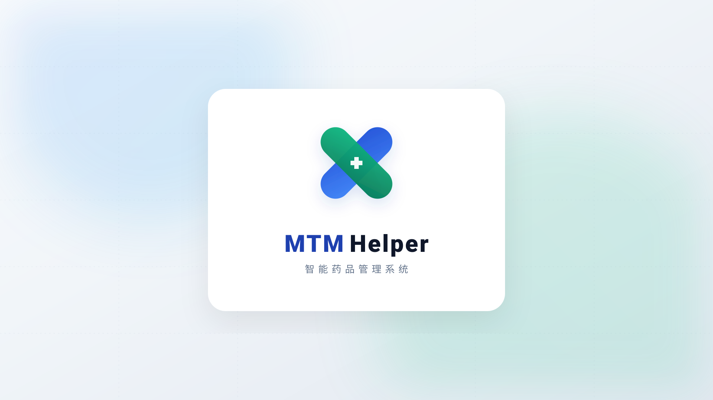

<div align="center">
  
  <h1>💊 MTM-Helper 智能用药助手与管理系统</h1>
  <p>专为老年人与专业药师打造的智能化药物治疗管理 (MTM) 平台</p>
</div>

## 📖 项目简介

MTM-用药助手是一款旨在提升老年人用药安全与依从性的智能管理系统。系统结合了面向普通用户的**日常用药提醒**与面向专业药师的 **MTM（药物治疗管理）服务**。通过简洁的适老化界面、AI 辅助增强（Copilot）以及多渠道提醒机制，解决忘记服药、药品过期、用药冲突等痛点，提供全生命周期的健康管理。

## ✨ 核心特性与近期重磅更新

### 1. 👨‍⚕️ 专业的 MTM 药物治疗管理 (3.0 架构升级)
引入了专业的双轨服务模式，打通了 MTM 的完整业务流：
- **完整闭环**：涵盖问诊 (Interview)、评估 (Assessment)、干预计划 (Plan) 与随访 (Follow-up) 四个核心环节。
- **医疗级文书导出**：支持自动聚合生成 PMR (个人用药记录) 与 MAP (药物行动计划)，并提供高保真 PDF 导出功能。
- **AI 辅助生成**：基于患者上下文，一键生成结构化 SOAP 药历草稿。

### 2. 🤖 AI 智能体管家 (AI Copilot)
基于 Baichuan M3 大模型集成的全局悬浮式页面助手：
- **用药问答**：随时解答用户的药品适应症、禁忌、相互作用等疑问。
- **智能引导**：针对不同角色（药师/患者），在首次进入仪表板时主动弹出并进行自然语言引导。
- **语音交互 (TTS & STT)**：完全打通了全局语音播报（TTS）与语音识别（STT）。老年人只需点击麦克风说话，AI 的回复也会自动通过语音播报，实现真正的“零打字”适老化交互。

### 3. 🔊 适老化与无障碍支持 (老年人模式)
- **全局语音播报**：开启“语音播报”后，系统会自动朗读页面的核心信息。内置智能打断与防抖去重机制，优先匹配优质中文语音。
- **极简大字版**：界面设计遵循 WCAG 标准，高对比度、大点击区域，充分照顾老年用户的使用习惯。

### 4. 📱 PWA 与全方位用药提醒
- **PWA 支持**：利用 `vite-plugin-pwa` 实现桌面/移动端应用安装，支持离线访问。
- **Web Push 推送**：基于 Service Worker 和 VAPID 提供浏览器原生的消息通知。
- **后端调度器**：支持多渠道推送，确保用药提醒万无一失。

### 5. 🏥 基础药品与数据管理
- 支持药品信息快速录入与管理。
- 动态服药历史记录追踪，生成用药依从性（Adherence）统计与可视化图表。

## 🛠 技术架构

**前端 (Frontend)**
- **核心框架**: Vue 3.4+ (Composition API) + TypeScript 5.0+
- **构建工具**: Vite 5.0+
- **状态与路由**: Pinia 2.0+ & Vue Router 4.0+
- **UI & 样式**: TailwindCSS 3.4+ + Lucide Icons
- **PDF导出**: jspdf + html2canvas

**后端 (Backend)**
- **核心框架**: Django 4.2+ & Django REST Framework
- **数据库**: MySQL 8.0+ (关系型数据) & Redis 7.0+ (缓存与任务队列)
- **认证体系**: JWT (JSON Web Token) 安全认证

**基础设施与扩展 (Infra & AI)**
- **AI 大模型**: Baichuan M3 API (兼容 OpenAI 格式接口)
- **容器化部署**: Docker & Docker Compose & Nginx

## 📂 项目结构

```text
mtm-helper/
├── src/                    # 前端源码目录
│   ├── api/                # 后端接口请求封装
│   ├── components/         # 通用 Vue 组件与页面布局
│   ├── composables/        # 组合式函数 (如 useSpeech 语音合成模块)
│   ├── pages/              # 业务页面 (MTM服务、用药记录等)
│   └── types/              # TypeScript 类型定义
├── backend/                # 后端 Django 源码目录
│   ├── apps/               # 独立业务模块
│   │   ├── mtm/            # 核心药物治疗管理逻辑
│   │   ├── reminders/      # 调度器与多渠道通知 (Push/SMS)
│   │   ├── medicines/      # 药品信息库
│   │   └── core/           # AI 代理与基础服务
│   └── mtm_helper/         # Django 项目配置
├── docs/                   # 项目设计与架构文档库
├── docker-compose.yml      # 开发环境容器编排
└── docker-compose.production.yml # 生产环境部署编排
```

## 🚀 快速开始

### 运行环境要求
- Node.js 20.0+
- Python 3.11+
- MySQL 8.0+ / Redis 7.0+

### 1. 前端本地开发
```bash
# 安装依赖
npm install

# 启动开发服务器
npm run dev
```

### 2. 后端本地开发
```bash
cd backend
python3 -m venv .venv
source .venv/bin/activate  # Windows 运行 .\.venv\Scripts\Activate.ps1

# 安装依赖
pip install -r requirements.txt

# 初始化数据库
cp .env.example .env
# 补全 .env 中的数据库和 AI API Key 配置

python manage.py makemigrations
python manage.py migrate

# 启动服务
python manage.py runserver 0.0.0.0:8000
```
> **注意**：如需体验 AI 页面助手和自动生成 SOAP 药历，请务必在 `backend/.env` 中补齐 `BAICHUAN_M3_API_KEY` 等大模型相关环境变量。并且配置好 VAPID 密钥对以开启 Web Push 推送。

### 3. Docker 容器化部署
**开发环境一键启动：**
```bash
docker-compose --profile dev up -d --build
```
**生产环境独立部署：**
项目内置了生产级部署方案（涵盖 Nginx 反代与静态资源挂载）：
```bash
docker compose -f docker-compose.production.yml up -d
```

## 🤝 参与贡献
欢迎对医疗健康、AI 智能体及适老化设计感兴趣的开发者加入！
1. Fork 本仓库
2. 创建您的特性分支 (`git checkout -b feature/AmazingFeature`)
3. 遵循现有的 ESLint 与代码规范进行开发
4. 提交您的更改 (`git commit -m 'feat: Add some AmazingFeature'`)
5. 推送到分支并开启 Pull Request

## 📄 许可证
本项目基于 [MIT License](LICENSE) 开源。

---
*MTM-Helper — 科技让关爱更智能。*
