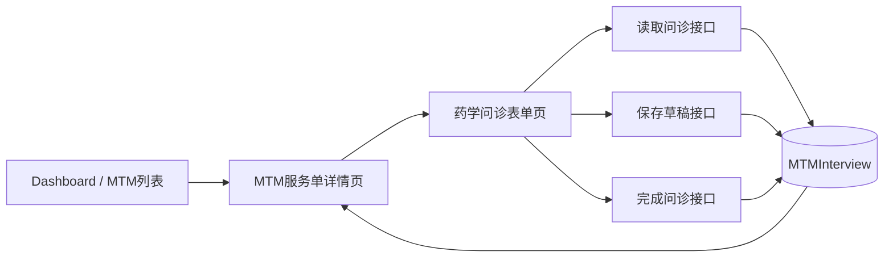
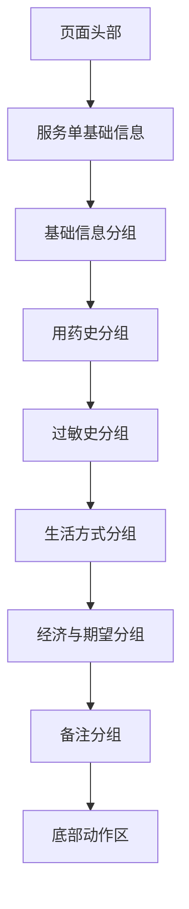
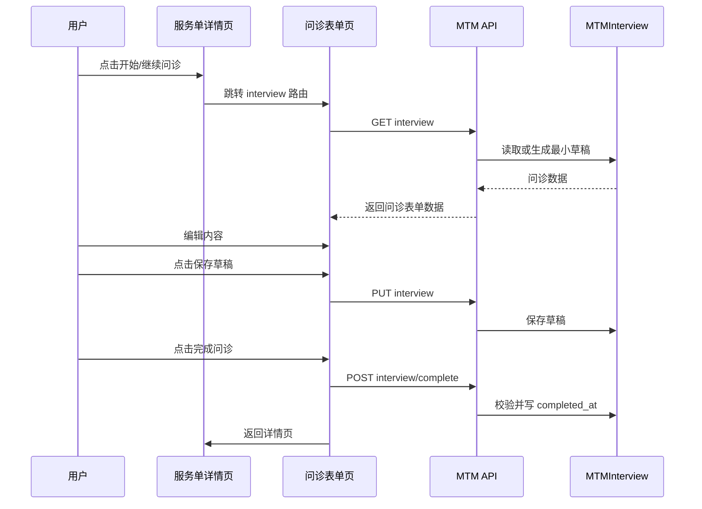

# DESIGN_P1-B1_药学问诊表单最小落地

## 1. 设计目标

在不改变当前 MTM 主路径的前提下，为 `MTMServiceCase` 增加一个最小可用的药学问诊编辑闭环，使现有“服务单 -> 问诊摘要”从只读展示升级为“可编辑、可保存、可完成”的结构化能力。

## 2. 总体架构

## 3. 分层设计

### 3.1 前端层

- `MtmServiceCaseDetailPage.vue`
  - 增加“开始问诊 / 继续问诊”入口
- 新增 `MtmInterviewFormPage.vue`
  - 承担问诊表单编辑、手动保存、完成问诊
- `src/api/mtm.ts`
  - 增加问诊读取 / 保存 / 完成接口封装
- `src/types/mtm.ts`
  - 增加问诊表单读写 payload 类型

### 3.2 后端层

- `apps.mtm.views`
  - 在 `MTMServiceCaseViewSet` 下新增问诊相关 detail action
- `apps.mtm.serializers`
  - 新增问诊表单读写序列化器
- `apps.mtm.models`
  - 继续复用现有 `MTMInterview`

## 4. 路由设计

### 4.1 新增前端路由

- 路径：`/mtm/service-cases/:id/interview`
- 名称：`MtmInterviewForm`
- 权限：登录后可访问，且仅当前服务单参与者可通过后端访问数据

### 4.2 入口策略

- 服务单详情页中：
  - `pending` 状态显示“开始问诊”
  - `interviewing` 状态显示“继续问诊”
  - 已存在问诊但未完成时，优先展示“继续问诊”

## 5. 接口设计

### 5.1 读取问诊

- 方法：`GET /api/mtm/service-cases/{id}/interview/`
- 目标：
  - 有问诊记录时返回现有内容
  - 无问诊记录时返回最小空草稿结构

返回字段建议：

- `id`
- `basic_info_snapshot`
- `medication_history`
- `allergy_history`
- `lifestyle_info`
- `economic_context`
- `health_expectations`
- `notes`
- `completed_at`
- `created_at`
- `updated_at`

### 5.2 保存草稿

- 方法：`PUT /api/mtm/service-cases/{id}/interview/`
- 目标：
  - 更新或首次创建问诊草稿
  - 不写 `completed_at`

### 5.3 完成问诊

- 方法：`POST /api/mtm/service-cases/{id}/interview/complete/`
- 目标：
  - 复用同一套字段保存
  - 通过完整性校验后写入 `completed_at`
  - 不自动推进服务单状态

## 6. 数据契约设计

### 6.1 表单字段映射

| 表单分组 | 存储字段 |
| --- | --- |
| 基础信息 | `basic_info_snapshot` |
| 当前与既往用药 | `medication_history` |
| 过敏与不良反应 | `allergy_history` |
| 生活方式 | `lifestyle_info` |
| 经济背景 | `economic_context` |
| 健康期望 | `health_expectations` |
| 补充说明 | `notes` |

### 6.2 关键字段完整性规则

建议第一轮至少校验以下项：

- `basic_info_snapshot` 至少有 1 组有效基础信息
- `medication_history` 不为空或显式声明“当前无用药”
- `health_expectations` 或 `notes` 至少填写一项

说明：

- 第一轮校验不追求医疗专业完整性
- 只做“够用的完成门槛”

## 7. 页面结构设计

### 7.1 表单页结构

### 7.2 底部动作区

- `保存草稿`
- `完成问诊`
- `返回详情`

动作语义：

- 保存草稿：保存当前内容，不校验完成门槛
- 完成问诊：执行完整性检查，通过后写入 `completed_at`
- 返回详情：直接离开，不自动保存

## 8. 数据流向

## 9. 异常处理策略

### 9.1 前端

- 读取失败：
  - 显示“问诊内容加载失败，请稍后重试”
- 保存失败：
  - 显示“草稿保存失败”
- 完成校验失败：
  - 高亮缺失分组
  - 给出人话提示，不弹技术错误

### 9.2 后端

- 服务单不存在或无权限：
  - 返回统一错误响应
- 提交字段格式不合法：
  - 返回统一校验错误
- 完成问诊时完整性不足：
  - 返回明确字段级错误或人话错误消息

## 10. 日志策略

- 后端记录：
  - 读取问诊
  - 保存草稿
  - 完成问诊
  - 权限拒绝
  - 校验失败
- 前端记录：
  - 加载问诊开始 / 成功 / 失败
  - 保存草稿开始 / 成功 / 失败
  - 完成问诊开始 / 成功 / 失败

## 11. 可行性结论

该设计完全复用现有 `MTMInterview` 与 `MTMServiceCase` 结构，不引入并行模型，也不改变当前详情页与状态流转主路径；实施复杂度可控，适合作为 `P1-B1` 的第一轮最小版本。

