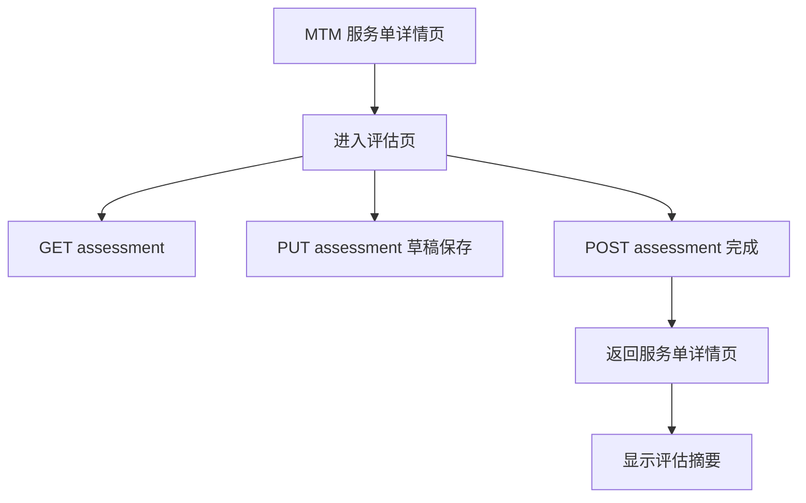

# DESIGN P1-B2 评估表单最小落地

## 1. 整体设计

## 2. 分层设计

### 2.1 后端

- 入口层：`MTMServiceCaseViewSet`
- 契约层：
  - `MTMAssessmentFormSerializer`
  - `MTMAssessmentDraftSerializer`
  - `MTMAssessmentCompleteSerializer`
- 领域对象：`MTMAssessment`

### 2.2 前端

- 路由层：新增 `MtmAssessmentForm`
- API 层：`mtmApi.getAssessment / saveAssessmentDraft / completeAssessment`
- 页面层：新增 `MtmAssessmentFormPage.vue`
- 详情页层：`MtmServiceCaseDetailPage.vue` 接入评估入口

## 3. 接口契约

### 3.1 读取评估

- 方法：`GET /api/mtm/service-cases/{id}/assessment/`
- 作用：
  - 返回当前服务单评估内容
  - 若不存在则生成最小草稿

### 3.2 保存草稿

- 方法：`PUT /api/mtm/service-cases/{id}/assessment/`
- 作用：
  - 保存当前草稿
  - 不写 `completed_at`

### 3.3 完成评估

- 方法：`POST /api/mtm/service-cases/{id}/assessment/complete/`
- 作用：
  - 保存评估内容
  - 写入 `completed_at`
  - 不自动推进服务单状态

## 4. 数据契约

### 4.1 前端表单字段

- `appropriateness_score`
- `effectiveness_score`
- `safety_score`
- `adherence_score`
- `economic_score`
- `risk_level`
- `problem_list`
- `summary`

### 4.2 前端提交形态

- 五维评分以数字或空值提交
- `problem_list` 以前端多行文本收集，提交时映射为：
  - `[{ item: "..." }]`
- `summary` 使用纯文本

## 5. 页面交互设计

### 5.1 详情页

- 如果没有评估：
  - 展示“开始评估”
- 如果已有草稿但未完成：
  - 展示“继续评估”
- 如果已完成：
  - 展示“查看已填评估”

### 5.2 评估页

- 顶部固定三个动作：
  - 返回详情
  - 手动保存草稿
  - 完成评估
- 页面主体分为：
  - 五维评分
  - 综合风险等级
  - 问题清单
  - 评估总结

## 6. 详情页状态动作协调

- `interviewing` 阶段且评估未建立时：
  - 优先展示“开始评估”
  - 状态动作区不再同时出现“进入评估”主按钮
- `interviewing` 阶段且评估已建立后：
  - 状态动作可保留，但改成“标记为评估中”
- 目标：
  - 先填写，再决定是否同步状态
  - 保持和 `P1-B1` 同样的单一路径体验

## 7. 异常处理策略

- 缺少服务单编号：
  - 页面直接提示无法进入
- 草稿读取失败：
  - 显示错误提示，不渲染假数据
- 保存失败：
  - 保留当前输入并提示失败
- 完成失败：
  - 展示后端校验错误，停留在当前页

## 8. 最小完成校验

- 至少填写一项评分
- 至少填写一项问题清单或评估总结
- 必须选择综合风险等级

## 9. 与现有架构对齐点

- 不新增新 app
- 不新增新表
- 不引入新状态
- 不改现有统一返回包裹格式
- 不改变详情页已有评估摘要渲染结构，只补入口与数据来源
