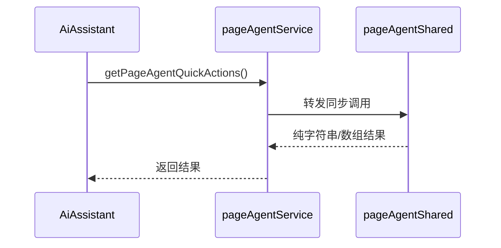
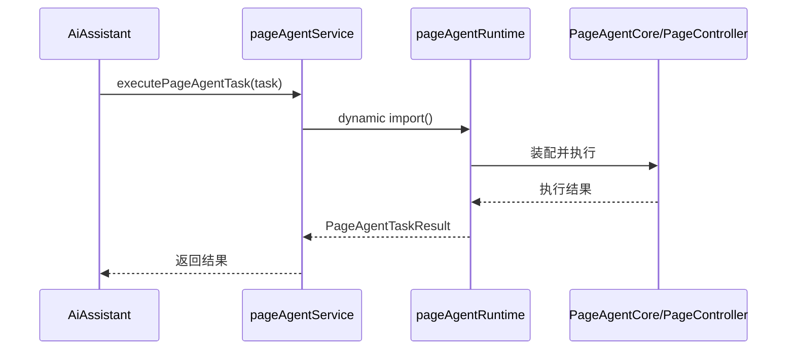

# DESIGN_T-GOV-05A_前端构建提示治理_page-agent接入层能力收缩实现设计

## 一、设计目标

本轮 `T-GOV-05A` 只做接入层最小收缩，目标是：

1. 保持全局 AI 助手入口、页面助手模式、交互语义和返回结构不变
2. 将同步轻逻辑与 `page-agent` 重运行时逻辑拆开
3. 让 `@page-agent/core` 与 `@page-agent/page-controller` 不再随着 `AiAssistant` 的默认静态依赖直接进入轻量展示模块
4. 为后续进一步验证默认主路径暴露范围收缩提供回滚点

明确非目标：

1. 不承诺本轮消除构建日志中的 `eval warning`
2. 不修改 `vite.config.ts`
3. 不自定义新的 `PageController`
4. 不扩展页面助手功能

---

## 二、单一路径方案

### 2.1 方案选择

本轮只采用以下单一路径：

1. 新增 `pageAgentShared` 承载同步轻逻辑与共享类型
2. 新增 `pageAgentRuntime` 承载 `PageAgentCore`、`PageController` 和实际执行逻辑
3. 将 `pageAgentService` 收缩为轻量门面层，只保留：
   - 同步轻逻辑转发
   - 运行时动态装配入口

不采用：

1. 直接在 `AiAssistant.vue` 中手写复杂的懒加载分支
2. 直接 patch 现有 `PageController`
3. 直接改三方依赖版本

### 2.2 模块边界

```mermaid
flowchart LR
  A[AiAssistant.vue] --> B[pageAgentService.ts 轻门面]
  B --> C[pageAgentShared.ts 同步轻逻辑]
  B -.按需动态加载.-> D[pageAgentRuntime.ts 重运行时]
  D --> E[@page-agent/core]
  D --> F[@page-agent/page-controller]
```

说明：

1. `AiAssistant.vue` 继续只依赖 `pageAgentService.ts`
2. 页面范围提示、快捷问题等同步展示逻辑从 `pageAgentService.ts` 抽到 `pageAgentShared.ts`
3. 真正执行页面助手任务时，`pageAgentService.ts` 再动态导入 `pageAgentRuntime.ts`

---

## 三、接口契约

### 3.1 对外保持不变的接口

`src/services/pageAgentService.ts` 对外仍保持：

1. `getCurrentPageAgentScopeDescription()`
2. `getPageAgentQuickActions()`
3. `canUsePageAgentOnCurrentPage()`
4. `executePageAgentTask(task)`
5. `PageAgentMode`
6. `PageAgentActionProposal`
7. `PageAgentTaskResult`

### 3.2 内部接口划分

`pageAgentShared.ts` 负责：

1. 共享类型
2. 页面范围识别
3. 快捷问题生成
4. 同步页面文案和纯函数工具

`pageAgentRuntime.ts` 负责：

1. `PageAgentCore` 单例
2. `PageController` 装配
3. 页面快照工具
4. 页面任务实际执行

`pageAgentService.ts` 负责：

1. 转发同步轻逻辑
2. `executePageAgentTask()` 内部动态导入运行时模块

---

## 四、数据与执行流

### 4.1 默认展示路径



结果：

1. 默认展示路径不触发 `page-agent` 重运行时
2. 页面提示和快捷问题仍按原语义返回

### 4.2 页面助手执行路径



---

## 五、风险控制

### 5.1 兼容性风险

风险：

- 拆分后若类型或纯函数遗漏，可能影响 `AiAssistant` 编译

控制：

1. 对外导出名保持不变
2. 先复制稳定逻辑，再收缩原文件
3. 用 TypeScript 诊断与构建验证接口完整性

### 5.2 行为回归风险

风险：

- 页面助手执行结果、快捷问题或范围提示与原来不一致

控制：

1. 不改已有业务文案
2. 不改页面助手返回结构
3. 不改 `executePageAgentTask()` 的对外调用方式

### 5.3 任务膨胀风险

风险：

- 实现中顺手滑向 `T-GOV-05B`

控制：

1. 不碰 `PageController.executeJavascript()`
2. 不碰 `vite.config.ts`
3. 不碰三方依赖和 patch

---

## 六、验证策略

本轮验证只做聚焦检查：

1. TypeScript / Vue 诊断无新增错误
2. 前端构建通过
3. `pageAgentService.ts` 不再顶层静态导入 `@page-agent/core` 与 `@page-agent/page-controller`
4. `AiAssistant.vue` 仍只依赖原有门面接口
5. 页面助手执行入口仍存在且签名不变

---

## 七、回滚点

若本轮实现出现问题，可直接回滚以下边界：

1. 删除 `pageAgentShared.ts`
2. 删除 `pageAgentRuntime.ts`
3. 将 `pageAgentService.ts` 恢复为原单文件实现

本轮回滚不会影响：

1. 其他业务页面
2. 后端接口
3. 路由结构
4. 现有页面助手对外承诺
