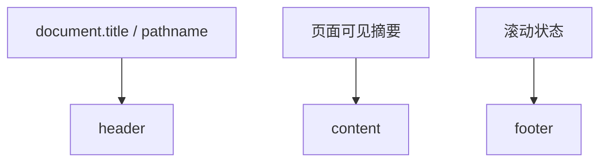

# DESIGN_T-GOV-05B_前端构建提示治理_自定义受限版PageController实现设计

## 一、设计目标

`T-GOV-05B` 的设计目标为：

1. 在项目内提供本地 `RestrictedPageController`
2. 用它替换 `pageAgentRuntime.ts` 中的默认 `PageController`
3. 尽量让 `@page-agent/page-controller` 不再进入实际前端构建图
4. 保持当前页面助手主路径可用

明确非目标：

1. 不追求完整复刻默认控制器
2. 不扩展页面助手能力
3. 不修改 `vite.config.ts`
4. 不升级 `@page-agent/*`

---

## 二、单一路径方案

### 2.1 推荐方案

本轮冻结以下唯一推荐方案：

1. 新增 `src/services/restrictedPageController.ts`
2. 在该文件中实现本地 `RestrictedPageController` 类
3. 在 `src/services/pageAgentRuntime.ts` 中将 `new PageController(...)` 替换为 `new RestrictedPageController(...)`
4. 保留当前 `pageAgentShared.ts` 与 `pageAgentService.ts` 不变

### 2.2 不推荐方案

以下方案不作为主路径：

1. `extends PageController` 再覆写 `executeJavascript()`
2. 包一层代理类后内部仍持有默认 `PageController`
3. 直接复制三方 `PageController.ts` 全量源码到仓内

原因：

1. 前两条仍会运行时导入默认控制器
2. 第三条维护成本过高，偏离最小实现原则

---

## 三、模块边界

```mermaid
flowchart LR
  A[AiAssistant.vue] --> B[pageAgentService.ts]
  B --> C[pageAgentRuntime.ts]
  C --> D[RestrictedPageController]
  C --> E[@page-agent/core]
  B --> F[pageAgentShared.ts]
```

目标变化点：

1. 保持 `AiAssistant.vue` 和 `pageAgentService.ts` 不变
2. 只在 `pageAgentRuntime.ts` 替换控制器装配点
3. 新增本地控制器作为唯一新运行时组件

---

## 四、控制器契约设计

### 4.1 第一版必需方法

`RestrictedPageController` 第一版必须提供：

1. `getBrowserState()`
2. `getLastUpdateTime()`
3. `scroll()`
4. `showMask()`
5. `hideMask()`
6. `cleanUpHighlights()`
7. `dispose()`

### 4.2 第一版受限方法

以下方法第一版直接显式禁用：

1. `clickElement()`
2. `inputText()`
3. `selectOption()`
4. `executeJavascript()`
5. `scrollHorizontally()`

建议返回统一结构：

```ts
{ success: false, message: '当前页面助手已禁用该交互能力。' }
```

这样做的原因：

1. 当前业务本就禁用了这些工具
2. 显式返回更有利于日志诊断
3. 不会把受限控制器做成“不完整对象”

---

## 五、BrowserState 设计

### 5.1 设计原则

第一版 `getBrowserState()` 不追求还原默认控制器的完整简化 DOM，而是输出稳定、可读、对当前业务足够有用的受限 `BrowserState`。

### 5.2 数据来源

优先复用项目内已有逻辑：

1. 当前页面标题
2. 当前路由
3. `getCurrentPageAgentScopeDescription()`
4. 现有页面快照函数所依赖的通用 DOM 提取逻辑
5. 当前页面可见标题、按钮、表格预览、卡片摘要、风险关键词

### 5.3 推荐结构



推荐输出：

1. `header`：页面标题、地址、页面范围、滚动位置提示
2. `content`：可见标题、关键指标、列表/表格摘要、按钮摘要、风险信号
3. `footer`：是否还有更多内容可继续滚动

### 5.4 质量门控

第一版 `content` 只要满足以下条件即可：

1. 能让模型知道当前页面是什么
2. 能让模型看到当前页面最重要的块信息
3. 能让模型识别是否需要继续滚动

---

## 六、滚动与生命周期设计

### 6.1 垂直滚动

`scroll()` 第一版保留，建议：

1. 支持页面级垂直滚动
2. 支持按像素或按页比例滚动
3. 滚动后更新 `lastUpdateTime`

### 6.2 水平滚动

`scrollHorizontally()` 第一版直接禁用。

原因：

1. 当前业务主路径不依赖宽表格精细横向浏览
2. 可进一步缩小第一版复杂度

### 6.3 遮罩与高亮

当前 `pageAgentRuntime.ts` 中默认就是 `enableMask: false`，因此：

1. `showMask()` 可做 no-op
2. `hideMask()` 可做 no-op
3. `cleanUpHighlights()` 可做 no-op
4. `dispose()` 只需做状态清理

---

## 七、实现顺序

建议后续实施按以下顺序进行：

1. 先新增 `RestrictedPageController` 骨架与全部方法签名
2. 先实现生命周期与禁用方法返回
3. 再实现 `getBrowserState()` 与 `scroll()`
4. 最后在 `pageAgentRuntime.ts` 单点替换装配入口
5. 再运行构建与页面助手聚焦验证

---

## 八、验证策略

后续若进入实现，建议验证顺序如下：

1. TypeScript / Vue 诊断通过
2. 前端构建通过
3. 构建日志确认是否仍出现 `@page-agent/page-controller eval warning`
4. 页面助手在以下页面做人工验证：
   - 仪表板
   - 药品页
   - 提醒页
   - 病历页
5. 验证草稿识别、保守分析、人工确认跳转是否保持可用

---

## 九、风险与降级

### 9.1 主要风险

1. 页面结构摘要不如默认控制器细，导致分析质量下降
2. 页面较长时，滚动后观察信息不够稳定
3. 某些模型步骤可能仍尝试调用已禁用方法

### 9.2 降级方案

若第一版 `RestrictedPageController` 质量不达标，建议降级顺序为：

1. 保留 `05A` 已有实现，不上线 `05B`
2. 补强 `getBrowserState()` 的内容组织质量
3. 仅在必要时再评估是否局部迁移三方 DOM 提取逻辑

---

## 十、回滚点

后续若实现失败，可直接回滚：

1. 删除 `restrictedPageController.ts`
2. 将 `pageAgentRuntime.ts` 的控制器装配恢复为默认 `PageController`

此回滚不会影响：

1. `05A` 的接入层收缩结果
2. `pageAgentShared.ts`
3. `pageAgentService.ts`
4. 页面助手对外入口
