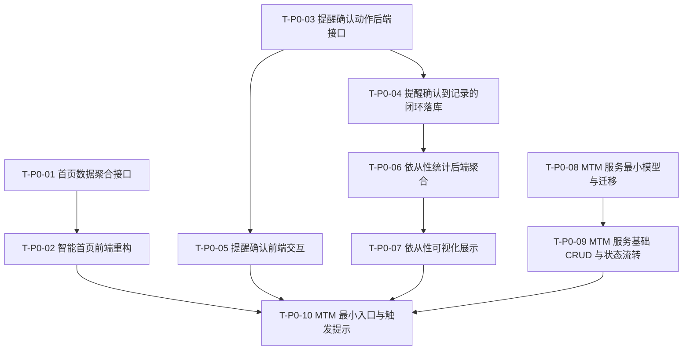

# TASK_P0_正式拆分

本文件将 3.0 方案中当前最适合启动的 P0 范围，拆分为可独立执行、可逐项验收的原子任务。

目标不是一次性做完“完整 MTM 平台”，而是按当前项目现状完成两件事：

- 把链路A从“功能集合”提升为“任务驱动型闭环”
- 为链路B建立最小可运行的专业服务骨架

---

## 一、P0 总范围

本轮 P0 只包含以下五类目标：

1. 智能首页重构
2. 服药确认闭环
3. 依从性评分与展示
4. MTM 服务最小数据骨架
5. MTM 服务最小入口

本轮 P0 明确不包含：

- SOAP 正式模块
- PMR / MAP 正式模块
- 药师工作台完整版
- AI 自动评估
- 多系统集成
- 重型基础设施扩容

---

## 二、拆分原则

### 2.1 先复用现有模型，再新增专业骨架

链路A任务优先复用现有：

- `reminders`
- `records`
- `plans`
- `medical_records`

链路B只在必要处新增独立模型，避免在 `plans` 或 `medical_records` 上硬拼专业 MTM 流程。

### 2.2 每个任务必须能独立验收

每个任务必须满足：

- 有明确输入
- 有明确输出
- 有可验证结果
- 尽量可单独开发和联调

### 2.3 先打通闭环，再做高级体验

优先顺序必须是：

1. 数据能流转
2. 状态能追踪
3. 页面能展示
4. 体验再优化

---

## 三、P0 原子任务清单

## T-P0-01 首页数据聚合接口

**任务描述**

新增面向首页的聚合接口，把“今日待服药、漏服/延迟、低库存、临期、复诊提醒、依从性摘要、MTM入口提示”统一汇总给前端。

**输入契约**

- 前置依赖：现有 `reminders`、`records`、`medicines`、`medical_records` 数据可正常读取
- 输入数据：
  - 今日提醒数据
  - 近期用药记录
  - 药品库存与有效期
  - 复诊时间
  - 近 7 天 / 30 天依从性摘要
- 环境依赖：现有 Django + DRF 接口框架

**输出契约**

- 输出数据：统一首页聚合响应
- 交付物：
  - 新增首页聚合接口
  - 聚合序列化输出
  - 基础单元测试或接口测试
- 建议响应结构：
  - `today_tasks`
  - `risk_alerts`
  - `medication_summary`
  - `followup_summary`
  - `adherence_summary`
  - `mtm_entry_hint`
- 验收标准：
  - 接口返回真实数据
  - 返回结构稳定
  - 不依赖前端拼接多个接口才能展示首页核心内容

**实现约束**

- 技术栈：Django + DRF
- 接口规范：遵循项目统一响应格式
- 质量要求：不返回模拟数据；关键路径打印日志；避免 N+1 查询

**依赖关系**

- 前置任务：无
- 后置任务：T-P0-02
- 并行任务：T-P0-03、T-P0-06

---

## T-P0-02 智能首页前端重构

**任务描述**

基于首页聚合接口，把当前通用仪表板升级为“任务驱动型首页”。

**输入契约**

- 前置依赖：T-P0-01 完成
- 输入数据：首页聚合接口响应
- 环境依赖：现有 `DashboardPage.vue`、路由、认证状态已可用

**输出契约**

- 输出数据：新的首页展示逻辑
- 交付物：
  - 首页卡片重构
  - 今日任务区块
  - 风险提醒区块
  - 快捷操作区块
  - “需要专业用药指导？”入口
- 验收标准：
  - 首页基于真实数据展示
  - 缺少数据时有明确空态
  - 不展示模拟数据
  - 用户一眼能看到“今天要做什么”和“当前有什么风险”

**实现约束**

- 技术栈：Vue 3 + TypeScript + Pinia
- 接口规范：正确处理项目双层数据结构
- 质量要求：组件尽量复用；关键位置有调试日志；不增加冗余页面

**依赖关系**

- 前置任务：T-P0-01
- 后置任务：T-P0-10
- 并行任务：无

---

## T-P0-03 提醒确认动作后端接口

**任务描述**

为现有提醒模块补充“确认已服药 / 漏服 / 延迟 / 部分服用”的正式动作接口。

**输入契约**

- 前置依赖：现有提醒详情、提醒计划、用户身份校验正常
- 输入数据：
  - 提醒 ID
  - 确认动作类型
  - 实际服药时间
  - 数量与备注
- 环境依赖：现有 reminders app、records app

**输出契约**

- 输出数据：提醒响应结果 + 记录创建结果
- 交付物：
  - 新增提醒确认动作接口
  - 动作校验逻辑
  - 与用药记录联动逻辑
  - 基础测试
- 验收标准：
  - 用户可以对提醒执行确认动作
  - 非本人不能操作
  - 错误输入能被正确拦截

**实现约束**

- 技术栈：Django + DRF
- 接口规范：动作型接口保持返回结构清晰
- 质量要求：不能返回模拟响应；必须在原有提醒链路上改写，不另起冗余实现

**依赖关系**

- 前置任务：无
- 后置任务：T-P0-04、T-P0-05
- 并行任务：T-P0-01、T-P0-06

---

## T-P0-04 提醒确认到记录的闭环落库

**任务描述**

把提醒确认动作稳定映射为正式用药记录，形成“提醒 -> 确认 -> 记录 -> 统计”的完整链路。

**输入契约**

- 前置依赖：T-P0-03 完成
- 输入数据：
  - 提醒上下文
  - 对应药品信息
  - 确认结果
- 环境依赖：现有 `MedicationRecord` 模型

**输出契约**

- 输出数据：用药记录、库存变化、动作结果
- 交付物：
  - 提醒与记录映射规则
  - 记录来源字段规范
  - 延迟与漏服处理规则
  - 库存扣减联动验证
- 验收标准：
  - 已服药和部分服药能生成正确记录
  - 漏服不错误扣减库存
  - 延迟服药能保留时间差
  - 记录来源可识别为提醒触发

**实现约束**

- 技术栈：Django ORM
- 接口规范：避免重复创建记录
- 质量要求：幂等性要明确；库存处理要可追踪

**依赖关系**

- 前置任务：T-P0-03
- 后置任务：T-P0-06、T-P0-07
- 并行任务：无

---

## T-P0-05 提醒确认前端交互

**任务描述**

在现有提醒列表、提醒详情或消息入口中补充用户可直接执行的确认动作。

**输入契约**

- 前置依赖：T-P0-03 完成
- 输入数据：提醒确认接口
- 环境依赖：现有提醒页面与前端提醒服务

**输出契约**

- 输出数据：前端动作状态与刷新逻辑
- 交付物：
  - 已服药按钮
  - 漏服按钮
  - 延迟 / 部分服用入口
  - 提交状态提示
  - 动作完成后的列表刷新
- 验收标准：
  - 用户可以在 1 到 2 步内完成确认
  - 成功后页面状态与统计同步刷新
  - 失败时有明确提示

**实现约束**

- 技术栈：Vue 3 + TypeScript
- 接口规范：使用真实接口，不新增模拟流程
- 质量要求：操作反馈清晰；避免重复提交

**依赖关系**

- 前置任务：T-P0-03
- 后置任务：T-P0-10
- 并行任务：T-P0-04

---

## T-P0-06 依从性统计后端聚合

**任务描述**

把现有记录和提醒结果沉淀为可复用的依从性统计接口，用于首页和统计页展示。

**输入契约**

- 前置依赖：T-P0-04 完成
- 输入数据：
  - 用药记录状态
  - 时间范围
  - 提醒响应结果
- 环境依赖：现有 records app

**输出契约**

- 输出数据：
  - 最近 7 天依从性
  - 最近 30 天依从性
  - 漏服次数
  - 延迟次数
  - 风险等级
- 交付物：
  - 依从性统计服务
  - 依从性聚合接口
  - 低依从性判定规则
  - 基础测试
- 验收标准：
  - 能按时间范围正确统计
  - 指标定义稳定
  - 首页和统计页可共用

**实现约束**

- 技术栈：Django + DRF
- 接口规范：统计逻辑集中，避免前端自行计算
- 质量要求：边界条件明确；零数据时返回可展示结果

**依赖关系**

- 前置任务：T-P0-04
- 后置任务：T-P0-07、T-P0-10
- 并行任务：T-P0-08

---

## T-P0-07 依从性可视化展示

**任务描述**

在首页和现有统计页接入依从性结果，展示趋势与风险提示。

**输入契约**

- 前置依赖：T-P0-06 完成
- 输入数据：依从性统计接口
- 环境依赖：现有首页和统计页面

**输出契约**

- 输出数据：依从性卡片和趋势展示
- 交付物：
  - 首页依从性摘要卡
  - 统计页趋势展示
  - 连续低依从性风险提示
- 验收标准：
  - 至少可查看最近 7 天和 30 天
  - 展示数据与后端统计一致
  - 数据缺失时不报错

**实现约束**

- 技术栈：Vue 3 + TypeScript
- 接口规范：直接使用聚合接口
- 质量要求：不写死指标；不使用假数据

**依赖关系**

- 前置任务：T-P0-06
- 后置任务：T-P0-10
- 并行任务：无

---

## T-P0-08 MTM 服务最小模型与迁移

**任务描述**

新增链路B最小专业骨架模型，形成专业 MTM 服务的后端主线。

**输入契约**

- 前置依赖：无
- 输入数据：
  - 服务状态定义
  - 服务触发来源
  - 问诊、评估、计划、随访的最小字段集合
- 环境依赖：现有 Django 项目与数据库迁移机制

**输出契约**

- 输出数据：专业 MTM 核心模型
- 交付物：
  - `MTMServiceCase`
  - `MTMInterview`
  - `MTMAssessment`
  - `MTMPlan`
  - `MTMFollowUp`
  - 迁移文件
  - Admin 或基础调试支持
- 验收标准：
  - 模型可迁移
  - 外键关系清晰
  - 状态流转字段完整
  - 不把链路B硬塞到现有 plans / medical_records 中

**实现约束**

- 技术栈：Django ORM
- 接口规范：命名清晰，后续可扩展
- 质量要求：先做最小集，不做过度字段膨胀

**依赖关系**

- 前置任务：无
- 后置任务：T-P0-09
- 并行任务：T-P0-01、T-P0-03、T-P0-06

---

## T-P0-09 MTM 服务基础 CRUD 与状态流转

**任务描述**

为新增的 MTM 骨架提供基础接口，支持创建服务单、查看详情、更新状态。

**输入契约**

- 前置依赖：T-P0-08 完成
- 输入数据：
  - 服务单创建参数
  - 状态更新参数
  - 当前用户身份
- 环境依赖：认证系统与 DRF

**输出契约**

- 输出数据：MTM 服务基础接口
- 交付物：
  - 服务单创建接口
  - 服务单列表接口
  - 服务单详情接口
  - 状态流转接口
  - 基础序列化器与权限控制
- 验收标准：
  - 用户可以创建第一条 MTM 服务单
  - 状态至少支持：待开始 / 问诊中 / 评估中 / 干预中 / 随访中 / 已完成
  - 列表和详情可用

**实现约束**

- 技术栈：Django + DRF
- 接口规范：严格区分创建、详情、状态更新
- 质量要求：只做最小可运行流程；不提前引入复杂协作逻辑

**依赖关系**

- 前置任务：T-P0-08
- 后置任务：T-P0-10
- 并行任务：无

---

## T-P0-10 MTM 最小入口与触发提示

**任务描述**

在首页或关键入口中加入“专业用药指导”入口，并支持简单规则提示发起。

**输入契约**

- 前置依赖：T-P0-02、T-P0-05、T-P0-07、T-P0-09 完成
- 输入数据：
  - 首页聚合数据
  - 依从性摘要
  - 医疗记录摘要
  - MTM 服务创建接口
- 环境依赖：前端首页已可渲染任务和风险区块

**输出契约**

- 输出数据：链路B用户入口与触发逻辑
- 交付物：
  - “需要专业用药指导？”入口
  - 简单规则提示逻辑
  - 手动发起 MTM 服务
  - 创建成功后的状态展示
- 首版触发条件建议：
  - 用药数量达到阈值
  - 存在多个慢病记录
  - 连续低依从性
  - 用户主动申请
- 验收标准：
  - 用户可以看到专业入口
  - 用户可以手动发起服务
  - 满足规则时能看到提示

**实现约束**

- 技术栈：Vue 3 + TypeScript + Django + DRF
- 接口规范：触发提示与真实服务创建打通
- 质量要求：首版仅做提示，不做复杂自动分诊

**依赖关系**

- 前置任务：T-P0-02、T-P0-05、T-P0-07、T-P0-09
- 后置任务：P1 问诊 / SOAP / PMR / MAP / 药师工作台
- 并行任务：无

---

## 四、任务依赖图

---

## 五、建议执行顺序

### 第一阶段：链路A先闭环

建议顺序：

1. T-P0-03
2. T-P0-04
3. T-P0-06
4. T-P0-01
5. T-P0-05
6. T-P0-07
7. T-P0-02

原因：

- 先把“提醒 -> 记录 -> 统计”打通
- 再把结果汇总到首页
- 这样首页改造不会沦为纯样式改版

### 第二阶段：链路B先立骨架

建议顺序：

1. T-P0-08
2. T-P0-09
3. T-P0-10

原因：

- 没有模型就没有服务单
- 没有服务单就不应做专业入口

---

## 六、建议首个开发任务

如果现在正式进入编码，最推荐先做：

### 首任务：T-P0-03 提醒确认动作后端接口

理由：

- 它是链路A闭环的起点
- 复用现有模块最多
- 能直接带动 T-P0-04、T-P0-05、T-P0-06
- 做完后很快就能看到真实用户价值

首任务完成后，最顺的后续顺序是：

1. T-P0-04
2. T-P0-06
3. T-P0-05
4. T-P0-01
5. T-P0-02

---

## 七、每项任务的统一验收口径

所有 P0 任务都应统一遵守以下要求：

- 使用真实接口，不展示模拟数据
- 保持项目现有统一响应格式
- 正确处理双层 `data` 嵌套
- 关键位置打印日志方便调试
- 不通过注释旧代码再新增整段冗余代码来规避问题
- 尽量在原有模块上增量改造
- 每完成一个任务就进行独立验证

---

## 八、P0 完成定义

当以下条件全部成立时，可视为 P0 完成：

1. 首页已经从功能导航页升级为任务型首页
2. 用户能从提醒直接确认已服药、漏服、延迟或部分服用
3. 系统能生成稳定的依从性统计
4. 首页和统计页能展示依从性结果
5. 系统中已经存在第一条可创建、可查看、可流转状态的 MTM 服务单
6. 用户已经能从首页进入最小专业服务入口

---

## 九、P0 完成后的自然下一步

P0 完成后，才能顺利进入 P1：

- 药学问诊表单
- SOAP 基础版
- PMR / MAP
- 药师工作台
- 专业角色与授权关系

本文件可直接作为下一轮开发执行与验收的拆分基础。
