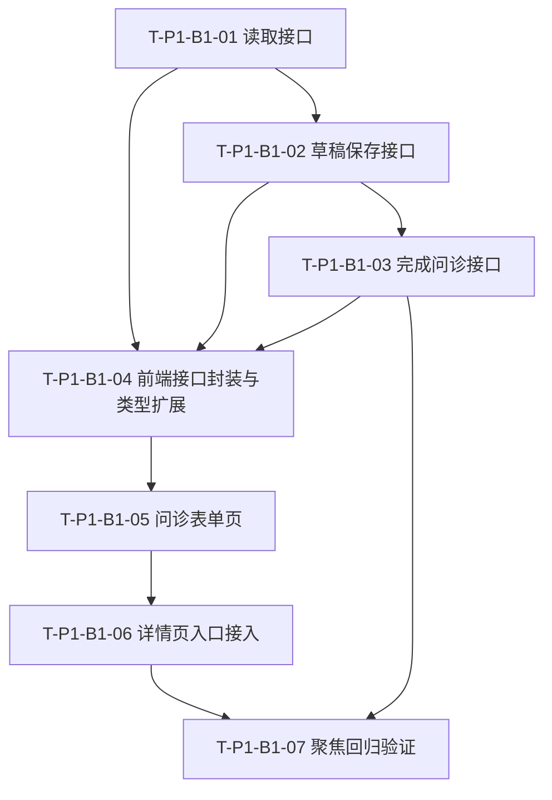

# TASK_P1-B1_药学问诊表单最小落地

## 1. 任务目标

把 `P1-B1 药学问诊表单` 拆成可独立验证的最小原子任务，使后续实现遵循“接口先行、页面接入、再做回归”的单一路径。

## 2. 原子任务拆分

### T-P1-B1-01 后端问诊读取接口

#### 输入契约

- 已存在 `MTMServiceCase`
- 已存在 `MTMInterview` 模型
- 当前用户是服务单参与者

#### 输出契约

- 提供 `GET /api/mtm/service-cases/{id}/interview/`
- 有问诊时返回现有问诊
- 无问诊时返回最小空草稿结构

#### 实现约束

- 不新增平行模型
- 继续使用统一响应包裹格式
- 接口权限与服务单详情保持一致

#### 验收标准

- 参与者可读
- 非参与者不可读
- 无问诊记录时也能稳定返回可编辑结构

### T-P1-B1-02 后端问诊草稿保存接口

#### 输入契约

- 已有读取接口
- 前端可提交问诊表单结构

#### 输出契约

- 提供 `PUT /api/mtm/service-cases/{id}/interview/`
- 支持首次创建或后续更新问诊草稿
- 不写 `completed_at`

#### 实现约束

- 保存逻辑幂等
- 不自动推进服务单状态

#### 验收标准

- 首次保存成功
- 二次编辑保存成功
- 再次读取可回填已保存内容

### T-P1-B1-03 后端完成问诊接口

#### 输入契约

- 已有草稿保存接口
- 已定义关键字段完整性检查规则

#### 输出契约

- 提供 `POST /api/mtm/service-cases/{id}/interview/complete/`
- 通过校验时写入 `completed_at`
- 不自动推进到 `assessing`

#### 实现约束

- 与草稿保存共用同一份字段契约
- 失败时返回清晰的人话校验信息

#### 验收标准

- 关键字段不完整时无法完成
- 校验通过后可成功完成
- 完成后详情接口可读取到 `completed_at`

### T-P1-B1-04 前端 MTM 接口封装与类型扩展

#### 输入契约

- 后端读取 / 保存 / 完成接口已定义

#### 输出契约

- `src/api/mtm.ts` 增加问诊相关方法
- `src/types/mtm.ts` 增加问诊表单读写类型

#### 实现约束

- 继续遵循当前双层响应数据读取口径
- 打印关键日志

#### 验收标准

- 前端可正常获取问诊数据
- 前端可正常保存草稿
- 前端可正常完成问诊

### T-P1-B1-05 问诊表单页落地

#### 输入契约

- 前端接口封装完成
- 路由能力可扩展

#### 输出契约

- 新增独立问诊页
- 支持回填
- 支持手动保存草稿
- 支持完成问诊

#### 实现约束

- 不在详情页内堆大型表单
- 文案保持当前项目人话风格
- 不显示模拟数据

#### 验收标准

- 首次进入可编辑
- 退出后再次进入能恢复已保存内容
- 完成问诊后能回到详情页

### T-P1-B1-06 服务单详情页入口接入

#### 输入契约

- 问诊页已完成

#### 输出契约

- 在服务单详情页提供“开始问诊 / 继续问诊”入口
- 问诊完成后详情页摘要正常展示最新数据

#### 实现约束

- 不破坏现有详情页其他信息块
- 与当前状态文案保持一致

#### 验收标准

- `pending` / `interviewing` 状态下入口可见
- 可从详情页顺利进入问诊页
- 完成后详情页摘要可见更新

### T-P1-B1-07 聚焦回归验证

#### 输入契约

- 上述任务已完成

#### 输出契约

- 后端聚焦接口验证
- 前端手工走查
- 文档同步更新

#### 实现约束

- 验证以最小闭环为主
- 不顺手扩大范围到 SOAP / PMR / MAP

#### 验收标准

- 读取、保存草稿、完成问诊三条接口通过
- 问诊页主路径通过
- 详情页入口和摘要展示通过

## 3. 依赖关系

## 4. 执行顺序建议

1. 先做 `T-P1-B1-01`
2. 再做 `T-P1-B1-02`
3. 接着做 `T-P1-B1-03`
4. 然后做 `T-P1-B1-04`
5. 再做 `T-P1-B1-05`
6. 最后完成 `T-P1-B1-06` 和 `T-P1-B1-07`

## 5. 当前批准建议

当前 `P1-B1` 已具备进入实现阶段的最小条件。若无新增边界调整，可按本任务拆分直接进入编码实施。

