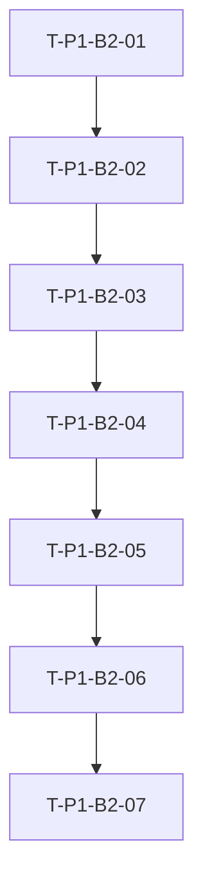

# TASK P1-B2 评估表单最小落地

## 1. 原子任务拆分

### T-P1-B2-01 后端评估读取接口

- 输入契约：
  - 已存在服务单 `id`
  - 当前用户是患者或参与药师
- 输出契约：
  - 返回最小评估草稿
  - 若评估不存在则自动初始化
- 实现约束：
  - 复用 `MTMAssessment`
  - 不扩表

### T-P1-B2-02 后端评估草稿保存接口

- 输入契约：
  - 评估表单草稿 payload
- 输出契约：
  - 成功保存评估草稿
  - 不写 `completed_at`
- 实现约束：
  - 保留空草稿能力
  - 记录必要日志

### T-P1-B2-03 后端完成评估接口

- 输入契约：
  - 完成态评估 payload
- 输出契约：
  - 成功写入评估内容和 `completed_at`
- 实现约束：
  - 不自动推进服务状态
  - 做最小完成校验

### T-P1-B2-04 前端类型与 API 扩展

- 输入契约：
  - 已有 `src/types/mtm.ts`
  - 已有 `src/api/mtm.ts`
- 输出契约：
  - 新增评估草稿 payload
  - 新增读取 / 保存 / 完成 API

### T-P1-B2-05 评估表单页

- 输入契约：
  - 可访问服务单详情接口和评估接口
- 输出契约：
  - 可加载、保存、完成评估
- 实现约束：
  - 沿用 `P1-B1` 问诊页风格
  - 用普通用户能理解的人话表达

### T-P1-B2-06 服务单详情页评估入口接入

- 输入契约：
  - 已有评估页路由
- 输出契约：
  - 详情页存在唯一主评估入口
  - 状态动作与评估入口不再冲突

### T-P1-B2-07 聚焦验证

- 输入契约：
  - 本地前后端可访问
- 输出契约：
  - 后端聚焦测试通过
  - 前端主路径人工验证通过
  - 验收文档补齐

## 2. 依赖关系

## 3. 实施顺序

1. 先做 `T-P1-B2-01`
2. 再做 `T-P1-B2-02`
3. 接着做 `T-P1-B2-03`
4. 然后做 `T-P1-B2-04`
5. 再做 `T-P1-B2-05`
6. 最后完成 `T-P1-B2-06` 和 `T-P1-B2-07`

## 4. 每项任务的独立验收点

- 后端接口：
  - 可单独通过 `APIClient` 测试验证
- 前端评估页：
  - 能单独加载和提交
- 详情页入口：
  - 能单独验证按钮与跳转
- 整体主路径：
  - 从详情页进入评估页，再返回详情页回看摘要
