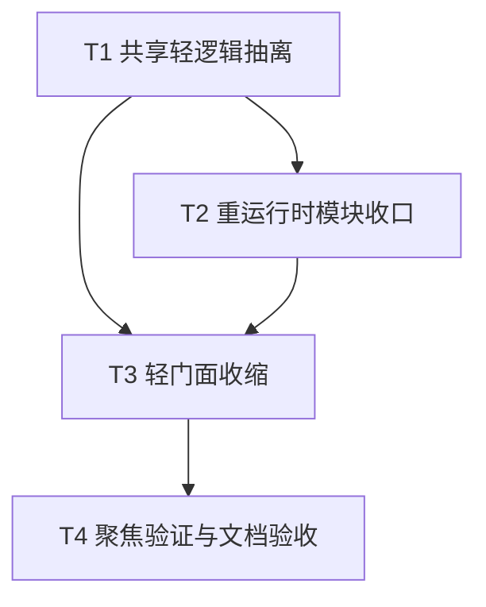

# TASK_T-GOV-05A_前端构建提示治理_page-agent接入层能力收缩实现拆分

## 一、任务目标

将 `page-agent` 接入层拆为“轻门面 + 同步共享模块 + 重运行时模块”，在不改变页面助手业务承诺的前提下，缩小默认主路径对 `@page-agent/*` 的静态暴露范围。

---

## 二、原子任务拆分

### T1 共享轻逻辑抽离

输入契约：

1. 当前 `src/services/pageAgentService.ts` 中存在页面范围识别、快捷问题与共享类型
2. 不改动现有业务文案和返回结构

输出契约：

1. 新增 `src/services/pageAgentShared.ts`
2. 抽出共享类型与纯同步函数
3. 保证不引入 `@page-agent/*` 运行时依赖

实现约束：

1. 文案保持一致
2. 类型名保持一致
3. 不新增冗余适配层

依赖关系：

- 为 `T2`、`T3` 前置依赖

### T2 重运行时模块收口

输入契约：

1. 已有共享轻逻辑模块
2. 原 `pageAgentService.ts` 中存在 `PageAgentCore`、`PageController` 和页面执行逻辑

输出契约：

1. 新增 `src/services/pageAgentRuntime.ts`
2. 仅在该模块中保留 `@page-agent/core` 与 `@page-agent/page-controller` 运行时依赖
3. 导出实际执行函数 `executePageAgentTask`

实现约束：

1. 保持页面助手执行语义不变
2. 保持日志与错误处理逻辑不变
3. 不改三方源码

依赖关系：

- 依赖 `T1`
- 为 `T3` 前置依赖

### T3 轻门面收缩

输入契约：

1. 已有共享轻逻辑模块
2. 已有重运行时模块

输出契约：

1. `src/services/pageAgentService.ts` 收缩为轻门面
2. 同步函数直接转发共享模块
3. `executePageAgentTask()` 通过动态导入调用运行时模块

实现约束：

1. 对外 API 名称不变
2. `AiAssistant.vue` 允许零改动或最小改动接入
3. 不改变页面助手主路径承诺

依赖关系：

- 依赖 `T1`、`T2`

### T4 聚焦验证与文档验收

输入契约：

1. 代码拆分已完成

输出契约：

1. 完成诊断检查
2. 完成至少一次前端构建验证
3. 生成 `ACCEPTANCE_T-GOV-05A`

实现约束：

1. 验证聚焦本任务边界
2. 不顺手处理无关 warning

依赖关系：

- 依赖 `T3`

---

## 三、任务依赖图

---

## 四、验收口径

本轮实现完成后，应满足：

1. `pageAgentService.ts` 不再顶层静态导入 `@page-agent/core`
2. `pageAgentService.ts` 不再顶层静态导入 `@page-agent/page-controller`
3. 页面助手同步展示逻辑仍可正常被 `AiAssistant.vue` 使用
4. `executePageAgentTask()` 对外调用方式不变
5. 前端能完成构建与基本诊断
