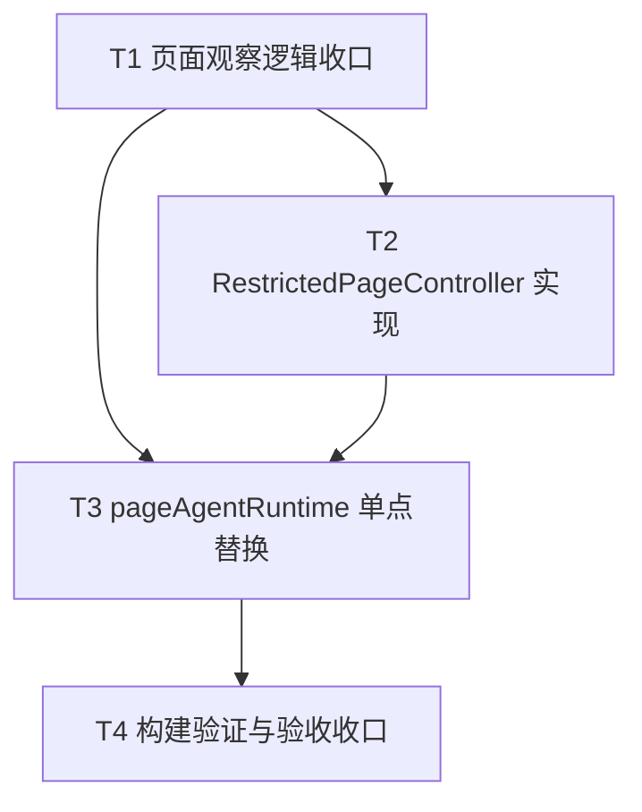

# TASK_T-GOV-05B_前端构建提示治理_自定义受限版PageController实现拆分

## 一、任务目标

按 `DESIGN_T-GOV-05B` 将默认 `PageController` 替换为项目内 `RestrictedPageController`，在不改变页面助手主路径承诺的前提下，尽量让 `@page-agent/page-controller` 不再进入实际前端构建图，并同步补齐验收文档。

---

## 二、原子任务拆分

### T1 页面观察逻辑收口

输入契约：

1. `src/services/pageAgentRuntime.ts` 已存在页面快照提取逻辑
2. 当前快照工具和运行时都依赖这些页面观察能力

输出契约：

1. 将页面观察与快照构造逻辑收口到受限控制器侧可复用模块
2. 保证现有页面快照工具仍能复用同一套逻辑

实现约束：

1. 不新增第二套页面观察逻辑
2. 不改变现有快照工具名称和用途

依赖关系：

- 为 `T2`、`T3` 前置依赖

### T2 RestrictedPageController 实现

输入契约：

1. 已明确 `BrowserState` 结构
2. 已明确最小方法集与禁用方法集

输出契约：

1. 新增 `src/services/restrictedPageController.ts`
2. 实现 `getBrowserState()`、`getLastUpdateTime()`、`scroll()`、`showMask()`、`hideMask()`、`cleanUpHighlights()`、`dispose()`
3. 显式禁用 `clickElement()`、`inputText()`、`selectOption()`、`executeJavascript()`、`scrollHorizontally()`

实现约束：

1. 为新增类和关键函数补函数级注释
2. 保持返回结构稳定
3. 不导入默认 `@page-agent/page-controller` 运行时实现

依赖关系：

- 依赖 `T1`
- 为 `T3` 前置依赖

### T3 pageAgentRuntime 单点替换

输入契约：

1. 已有 `RestrictedPageController`

输出契约：

1. `src/services/pageAgentRuntime.ts` 改为装配 `RestrictedPageController`
2. 不再运行时导入默认 `PageController`
3. 页面助手执行入口与自定义工具保持不变

实现约束：

1. 只改控制器装配点和必要依赖
2. 不改 `pageAgentService.ts`
3. 不改 `pageAgentShared.ts`

依赖关系：

- 依赖 `T1`、`T2`

### T4 构建验证与验收收口

输入契约：

1. 控制器替换已完成

输出契约：

1. 运行 TypeScript / Vue 诊断
2. 执行前端构建
3. 观察构建日志中 `@page-agent/page-controller eval warning` 是否变化
4. 生成 `ACCEPTANCE_T-GOV-05B`

实现约束：

1. 验证聚焦 `05B` 边界
2. 不顺手处理无关 warning

依赖关系：

- 依赖 `T3`

---

## 三、任务依赖图

---

## 四、验收口径

本轮实现完成后，应满足：

1. `src/services/pageAgentRuntime.ts` 不再运行时导入 `@page-agent/page-controller`
2. `RestrictedPageController` 已覆盖设计要求的最小方法集
3. 页面快照工具仍可用且未出现第二套重复逻辑
4. 前端构建通过
5. 已记录 `eval warning` 是否消失或变化
