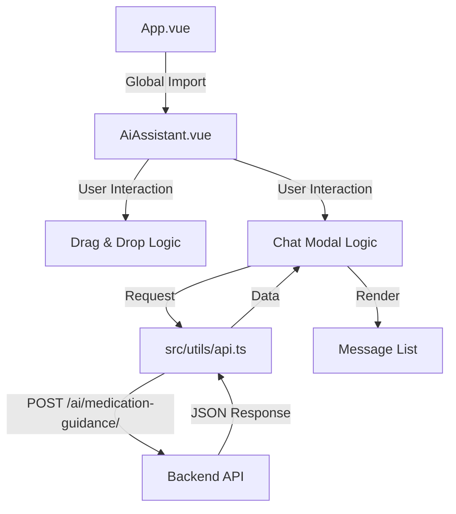

# 系统架构设计：AI 助手组件

## 1. 整体架构

## 2. 模块设计
### 2.1 核心组件 `AiAssistant.vue`
-   **View**:
    -   `RobotBubble`: 悬浮球容器，包含 SVG 和 问候气泡。
    -   `ChatModal`: 聊天窗口，包含 头部、消息列表、输入框。
-   **Model (State)**:
    -   `position`: `{x, y}` 坐标。
    -   `isIdle`: 是否闲置（控制隐藏样式）。
    -   `isOpen`: 聊天框开关。
    -   `messages`: 聊天记录数组。
-   **Controller (Logic)**:
    -   `startDrag`/`onDrag`/`stopDrag`: 处理拖拽与吸附。
    -   `sendMessage`: 处理 API 调用与错误状态。

### 2.2 接口契约
-   **Input**: 用户输入的文本。
-   **Output**: 机器人回复的文本（Markdown格式）。
-   **Error Handling**:
    -   网络错误 -> 显示 "网络连接失败，请重试"。
    -   业务拦截 (`blocked: true`) -> 显示拦截原因。

## 3. 关键逻辑流程
1.  **初始化**: 读取屏幕尺寸，定位到右下角，启动闲置计时器。
2.  **拖拽**: 禁用过渡效果 -> 跟随鼠标 -> 释放 -> 计算最近边缘 -> 开启过渡效果 -> 吸附 -> 重置计时器。
3.  **聊天**: 双击打开 -> 停止闲置计时 -> 用户输入 -> 锁定输入框 -> 发送请求 -> 接收响应 -> 解锁 -> 渲染 Markdown。
