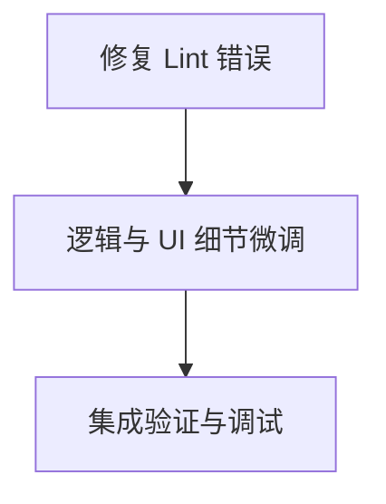

# 任务拆分：AI 助手完善与集成

## 任务依赖图

## 原子任务清单

### Task 1: 修复代码格式与 Lint 错误
-   **输入**: 包含 105 个错误的 `AiAssistant.vue`。
-   **执行**:
    1.  运行 `npm run lint -- --fix`。
    2.  手动修复剩余无法自动修复的错误（主要是 template 中的换行和属性排列）。
    3.  确保 SVG 结构在格式化后未被破坏（特别是 "AI" 字样的 transform）。
-   **验收**: `npm run lint` 返回 Pass。

### Task 2: 逻辑与 UI 细节微调
-   **输入**: 格式化后的代码。
-   **执行**:
    1.  检查双击与拖拽的冲突（确保双击不会误触发拖拽的一瞬间位移）。
    2.  确认 "AI" 字样的颜色值符合需求（翠绿色）。
    3.  优化错误处理逻辑（添加 try-catch 的 UI 反馈）。
-   **验收**: 交互流畅，无控制台逻辑错误。

### Task 3: 集成验证与调试
-   **输入**: 完成的组件。
-   **执行**:
    1.  添加关键日志 `console.log('[AI] Sending request...')`。
    2.  执行 `npm run build` 验证构建。
    3.  (可选) 尝试连接本地后端进行一次真实对话测试。
-   **验收**: 构建成功，日志显示请求路径正确。
