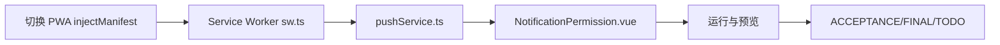

# TASK_用药提醒

本文件将“用药提醒-PWA 推送”拆分为可独立执行的原子任务，定义输入输出契约与依赖关系，并给出依赖图。

一、原子任务清单
1) 切换 VitePWA 至 injectManifest
   - 输入：现有 vite.config.ts、项目使用 `virtual:pwa-register`
   - 输出：更新后的 vite.config.ts（`strategies=injectManifest`、`src/sw.ts`、`devOptions.enabled=true`，保留 registerType=autoUpdate）
   - 验收：开发/构建通过，SW 正常注册，PWA 更新策略生效

2) 自定义 Service Worker sw.ts
   - 输入：CONSENSUS/DESIGN、Workbox API
   - 输出：`src/sw.ts`（precache、runtime 缓存、push/notificationclick、SKIP_WAITING）
   - 验收：push/local 通知弹出成功；点击能聚焦页面；控制台日志可见

3) 推送订阅服务 pushService.ts
   - 输入：VAPID 公钥（env）、统一 API 客户端
   - 输出：`src/services/pushService.ts`（订阅/取消订阅/保存订阅到后端；函数注释与日志）
   - 验收：在支持浏览器中订阅成功；失败有清晰错误提示；不展示模拟数据

4) 环境变量类型声明更新
   - 输入：`src/vite-env.d.ts`
   - 输出：补充 `VITE_VAPID_PUBLIC_KEY?: string`
   - 验收：TypeScript 通过编译，无类型错误

5) UI 更新：NotificationPermission.vue
   - 输入：pushService API
   - 输出：新增按钮与状态展示（启用订阅/取消订阅/测试通知），关键日志打印
   - 验收：操作符合预期，无冗余代码与模拟数据；失败最多尝试三次

6) 运行与预览
   - 输入：npm scripts、项目根目录
   - 输出：`npm run dev` 启动服务，展示预览链接
   - 验收：服务正常启动或复用现有端口；页面可操作并看到 UI 更新

7) 文档与交付
   - 输入：CONSENSUS/DESIGN
   - 输出：ACCEPTANCE、FINAL、TODO 文档（记录后端接口待办、VAPID、公网推送服务、iOS 策略）
   - 验收：文档完整一致，可用于后续协作与补充

二、任务依赖图

三、复杂度评估
- 前端：中等；涉及 PWA 插件配置调整、SW 编写与 Push 订阅交互。
- 后端：本次未改动；需要后续补充保存订阅与 WebPush 触发接口。