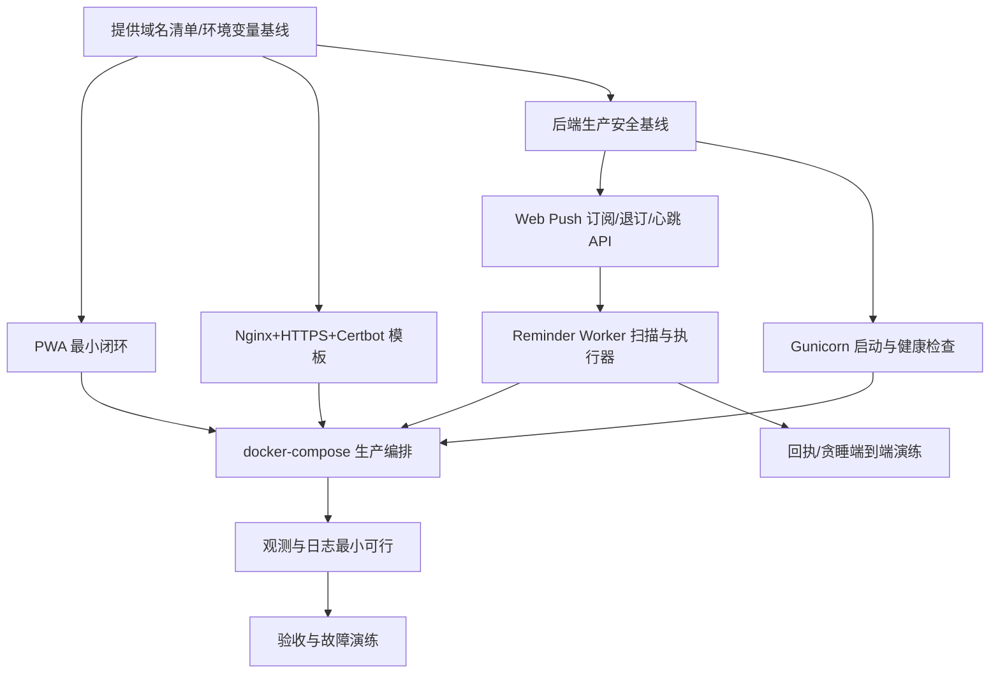

# TASK_移动端适配与生产部署方案

本文件将 DESIGN 文档落地为可执行的原子任务，每个任务包含输入契约、输出契约、实现约束、依赖关系与验收要点，并提供任务依赖图以指导执行顺序。

## 任务依赖图

---

## T1. 提供域名清单与环境变量基线
- 输入契约：
  - 提供生产域名/子域名清单（主域、API 域名若独立、静态域名若独立）。
  - 确认 SMTP 不启用（或提供 SMTP 凭据后可开关启用）。
  - Windows Server 宿主开放 80/443，DNS 已指向宿主。
- 输出契约：
  - docs/env/production.example（不提交敏感值，仅键名与说明）。
  - 域名清单文档，用于 ALLOWED_HOSTS/CSRF_TRUSTED_ORIGINS/CORS 白名单、Nginx server_name、证书申请。
- 实现约束：
  - 不提交真实密钥到仓库；全部走 .env。
  - 遵守现有 .env/.env.example 格式与命名风格。
- 依赖关系：无（所有下游均依赖本任务）。
- 验收要点：文档齐全、变量命名与现有后端一致。

## T2. 前端 PWA 最小闭环（vite1.config.ts 构建）
- 输入契约：
  - 现有前端依赖与构建脚本（package.json 指向 vite1.config.ts）。
- 输出契约：
  - 新增 manifest.webmanifest、注册 Service Worker、添加安装/权限引导 UI。
  - 引入 vite-plugin-pwa 配置（build 使用 vite1.config.ts）。
  - 移动端通知权限请求流程与错误处理日志。
  - 文档：如何在 iOS 安装 PWA 的用户指引。
- 实现约束：
  - 不使用 Vite 代理；生产由 Nginx 托管 dist。
  - 前端访问后端数据遵循双层 data：response.data.data.xxx。
  - 关键位置打印日志便于调试。
- 依赖关系：T1。
- 验收要点：PWA 可安装；离线可访问主要页面；更新策略可触发；不依赖任何 dev 代理。

## T3. Nginx + HTTPS + Certbot 生产模板
- 输入契约：
  - T1 域名清单。
- 输出契约：
  - nginx.conf 模板（80/443、HTTP->HTTPS、/.well-known/acme-challenge 直通、反代 /api、静态托管 dist、gzip/br、缓存、安全头）。
  - certbot sidecar 配置（卷挂载、续期计划与 reload）。
  - docs/nginx/README（上线前替换占位域名、检查项）。
- 实现约束：
  - 不暴露管理端口；证书与密钥只读挂载。
  - HSTS 初期不加 preload 标志，待稳定后再开。
- 依赖关系：T1。
- 验收要点：80 完成 http-01 验证，443 生效 TLS，安全头检查通过。

## T4. 后端生产安全基线（Django 设置）
- 输入契约：
  - 现有 settings 与 .env.
  - T1 域名清单。
- 输出契约：
  - settings.py：DEBUG=False、ALLOWED_HOSTS/CSRF_TRUSTED_ORIGINS/CORS 白名单、SECURE_SSL_REDIRECT=True、SECURE_PROXY_SSL_HEADER 设置、Cookie 安全属性、JSON 结构化日志格式。
  - 数据库连接参数：CONN_MAX_AGE=120s、connect_timeout=5s、read_timeout=15s。
- 实现约束：
  - 不改变返回结构契约（{success, data}）。
  - “魔法数字”必须在注释中说明依据与监控项。
- 依赖关系：T1。
- 验收要点：应用在生产模式可正常运行，跨域与 CSRF 行为正确。

## T5. Web Push 订阅/退订/心跳 API + VAPID
- 输入契约：
  - DESIGN 中的接口契约。
  - T4 已生效的安全基线。
- 输出契约：
  - 新增模型 WebPushSubscription（迁移）。
  - 3 个 REST API：/api/push/subscribe, /api/push/unsubscribe, /api/push/heartbeat。
  - VAPID 公私钥生成与 .env 配置项；pywebpush 集成。
  - 单元测试与错误处理（幂等退订、重复订阅）。
- 实现约束：
  - 函数级注释；不引入模拟响应；关键日志字段齐全。
  - 响应结构 {success, data}，严格校验参数。
- 依赖关系：T4。
- 验收要点：前端能完成订阅/退订/心跳；服务端校验与存储正确。

## T6. Gunicorn 启动与健康检查
- 输入契约：
  - 现有 backend/Dockerfile 与 compose。
- 输出契约：
  - 切换 gunicorn 启动（workers=3, threads=2, timeout=60s, graceful-timeout=30s）。
  - /api/healthz 健康检查端点。
- 实现约束：
  - 限制连接占用，避免超过 MySQL 100 的上限预算。
  - 记录参数变更的负载依据与回滚方案。
- 依赖关系：T4。
- 验收要点：容器健康检查通过，QPS 低负载稳定。

## T7. Reminder Worker（独立服务）与执行器
- 输入契约：
  - 现有 Reminder 模型与业务逻辑。
  - Redis 可用（提供密码经 .env）。
- 输出契约：
  - 独立 worker 容器与启动命令（管理命令 run_reminder_worker）。
  - 每分钟扫描 due reminders；Redis 分布式锁防重；指数退避重试；死信计数。
  - 执行器：优先 Web Push；不满足时生成 ICS 兜底链接。
  - 回执接口：/api/reminders/{id}/ack, /api/reminders/{id}/snooze。
- 实现约束：
  - 不与 web 进程共享调度；日志结构化；幂等键（reminder_id+attempt）。
- 依赖关系：T5, T6。
- 验收要点：端到端可触达；贪睡默认 15 分钟且可配置（5-60）。

## T8. docker-compose 生产编排
- 输入契约：
  - T2, T3, T6, T7 输出。
- 输出契约：
  - 使用 profile=production：nginx、certbot、backend(gunicorn)、worker、mysql、redis、frontend（构建产物卷）。
  - 健康检查、只读卷、限制权限、重启策略。
- 实现约束：
  - Windows Server 宿主运行 Linux 容器；避免特定 Linux 内核依赖。
- 依赖关系：T2, T3, T6, T7。
- 验收要点：一键启动生产编排，80/443/接口均可用。

## T9. 观测与日志最小可行
- 输入契约：
  - 现状无 ELK/Loki/Prometheus。
- 输出契约：
  - 统一 JSON 日志；核心字段（ts, svc, request_id, user_id, reminder_id, channel, status, latency_ms, error_type）。
  - 基础报警规则（推送失败率、调度滞后、5xx、Redis/DB 连接）。
  - 提供日志查询模板（grep/PowerShell/简单聚合）。
- 实现约束：
  - 性能开销受控；日志留存 30 天（由宿主轮转或卷策略）。
- 依赖关系：T6, T7。
- 验收要点：能快速定位失败原因与瓶颈。

## T10. 数据迁移、备份与回滚
- 输入契约：
  - MySQL 实例可用；提供备份目录位置。
- 输出契约：
  - 订阅表迁移脚本；备份策略（每日全量 02:00，保留 30 天；binlog 归档可选）。
  - 恢复演练步骤文档；蓝绿/灰度与快速回滚预案。
- 实现约束：
  - 不在业务高峰进行备份；备份完成通知与校验。
- 依赖关系：T5。
- 验收要点：备份可恢复；回滚路径明确。

## T11. 验收与演练
- 输入契约：
  - 全部上游任务完成。
- 输出契约：
  - ACCEPTANCE 记录：负载并发测试（P95 < 1s 在目标规模）、通知通道全链路、断网/超时故障演练、最终验收清单对照。
- 实现约束：
  - 每个用例有明确通过/失败标准与日志证据。
- 依赖关系：全部。
- 环境/依赖/验证（对齐 CONSENSUS）
- 环境
  - Ubuntu 22.04 LTS；Docker 28.4.0；Compose v2.39.2
  - 镜像加速器：https://qztpf1t5.mirror.aliyuncs.com
- 依赖
  - RDS MySQL（外部提供）：通过 .env 注入 DB_HOST/DB_PORT/DB_NAME/DB_USER/DB_PASSWORD
  - Redis（容器）：REDIS_PASSWORD 从 .env 注入
  - 短信通道：参数待提供；未就绪时 ICS 兜底
- 验证
  - docker/docker compose 版本打印符合预期
  - docker compose -f docker-compose.yml -f docker-compose.prod.yml config 合并通过
  - RDS/Redis 连通性命令返回正确

### 任务同步修订
- T1 补充：
  - 输出契约新增 .env.production.example 含 RDS 连接键名（不含密钥值）；记录镜像加速器变量 DOCKER_MIRROR_URL（说明默认已内置）。
  - 验收要点新增：提供正式域名清单；确认不在仓库提交任何凭据。
- T8 补充：
  - 实现约束：mysql 服务在 production profile 下移除，改为引用外部 RDS；所有 DB_* 从环境注入。
  - 验收要点：backend 与 worker 以 RDS 连接成功；健康检查通过。
- T10 补充：
  - 输入契约：提供 RDS 只读账号用于备份（推荐）或在维护窗口使用主账号；提供备份落盘路径。
  - 验收要点：脚本可在 02:00 触发并完成校验；恢复演练通过。
- 依赖关系：T2, T3, T6, T7。
- 验收要点：一键启动生产编排，80/443/接口均可用。

## T9. 观测与日志最小可行
- 输入契约：
  - 现状无 ELK/Loki/Prometheus。
- 输出契约：
  - 统一 JSON 日志；核心字段（ts, svc, request_id, user_id, reminder_id, channel, status, latency_ms, error_type）。
  - 基础报警规则（推送失败率、调度滞后、5xx、Redis/DB 连接）。
  - 提供日志查询模板（grep/PowerShell/简单聚合）。
- 实现约束：
  - 性能开销受控；日志留存 30 天（由宿主轮转或卷策略）。
- 依赖关系：T6, T7。
- 验收要点：能快速定位失败原因与瓶颈。

## T10. 数据迁移、备份与回滚
- 输入契约：
  - MySQL 实例可用；提供备份目录位置。
- 输出契约：
  - 订阅表迁移脚本；备份策略（每日全量 02:00，保留 30 天；binlog 归档可选）。
  - 恢复演练步骤文档；蓝绿/灰度与快速回滚预案。
- 实现约束：
  - 不在业务高峰进行备份；备份完成通知与校验。
- 依赖关系：T5。
- 验收要点：备份可恢复；回滚路径明确。

## T11. 验收与演练
- 输入契约：
  - 全部上游任务完成。
- 输出契约：
  - ACCEPTANCE 记录：负载并发测试（P95 < 1s 在目标规模）、通知通道全链路、断网/超时故障演练、最终验收清单对照。
- 实现约束：
  - 每个用例有明确通过/失败标准与日志证据。
- 依赖关系：全部。
- 验收要点：满足 CONSENSUS 中的所有验收标准。

---

## 全局实现约束
- 代码：函数级注释、风格与现有一致、避免冗余与重复、问题发现必须在原位置修复。
- 接口：后端不返回模拟响应；前端不使用任何模拟数据；严格双层 data 解构。
- 构建：不使用 Vite 代理；生产静态由 Nginx 提供。
- 环境：后端虚拟环境保持一个并持续复用；敏感信息均由 .env 管理且不提交。

## 执行与验证策略
- 每完成一个任务：验证输入契约 → 编写/更新测试 → 运行验证 → 更新文档与待办状态。
- 若遇到不确定性：立即中断并提出澄清项，记录在 TASK 文档中并在下一次迭代修正。