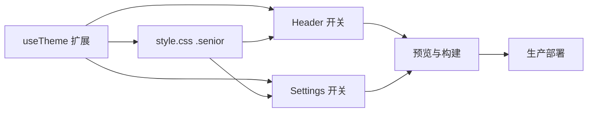

# 老年人模式 - 原子任务拆分

## 任务列表

1. 扩展 useTheme 支持 isSenior（已完成）
   - 输入契约：无外部输入；读取 localStorage('seniorMode')
   - 输出契约：提供 isSenior、toggleSenior；在挂载时应用 `.senior` 类
   - 约束：保持与原主题逻辑一致；打印日志
   - 依赖：无

2. 在 style.css 增加 `.senior` 样式（已完成）
   - 输入契约：根元素存在 `.senior`
   - 输出契约：更大字体、更高对比度、更大点击区域、清晰焦点样式
   - 约束：避免破坏布局，保守使用 !important
   - 依赖：任务1

3. 在 AppHeader.vue 增加开关按钮（已完成）
   - 输入契约：useTheme 提供 isSenior/toggleSenior
   - 输出契约：可交互的开关；状态可视化；日志
   - 约束：按钮可访问性 aria-pressed；不影响现有菜单
   - 依赖：任务1、2

4. 在 SettingsPage.vue 增加“辅助功能/老年人模式”开关（已完成）
   - 输入契约：useTheme 提供 isSenior/toggleSenior
   - 输出契约：一致的交互与视觉；日志
   - 约束：与提醒/隐私/安全分组并列展示；不显示模拟数据
   - 依赖：任务1、2

5. 本地预览与构建（进行/已完成）
   - 输入契约：项目依赖已安装
   - 输出契约：`npm run dev` 预览，`npm run build` 产出 dist/
   - 约束：避免重复启动多个端口；遵循 Windows 环境规则
   - 依赖：任务1-4

6. 生产部署（待确认）
   - 输入契约：确认生产环境（域名/端口/部署方式/路径）
   - 输出契约：dist 内容同步至生产并可访问
   - 约束：不使用代理；保持与后端约定一致；安全性与缓存策略按 Nginx 默认或既有方案
   - 依赖：任务5

## 依赖图
