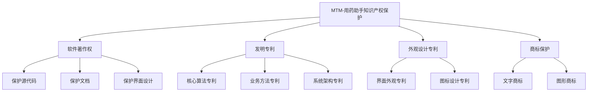

# MTM-用药助手知识产权组合保护策略

## 一、知识产权保护体系概述

针对MTM-用药助手项目，建议构建多层次的知识产权保护体系：

## 二、软件著作权保护策略

### 2.1 保护内容
- **源代码保护**：前后端约9.5万行代码
- **文档保护**：技术文档、设计文档、用户手册
- **界面保护**：老年人友好界面设计

### 2.2 申请策略
- **立即申请**：软件著作权登记（当前优先级最高）
- **版本管理**：每个重大版本更新后办理变更登记
- **国际保护**：考虑通过《伯尔尼公约》进行国际保护

### 2.3 优势分析
- ✅ **自动保护**：创作完成即自动产生著作权
- ✅ **成本低廉**：登记费用仅300元
- ✅ **审批快速**：2-3个月获得证书
- ✅ **保护全面**：保护表达形式而非思想

## 三、发明专利保护策略

### 3.1 可申请专利的核心技术

#### 3.1.1 用药提醒调度算法
- **技术要点**：基于用户行为习惯的自适应提醒算法
- **创新点**：动态调整提醒时间和方式
- **保护范围**：方法专利+系统专利
- **相关文件**：`backend/apps/reminders/scheduler.py`

#### 3.1.2 药品冲突检测方法  
- **技术要点**：多药品相互作用实时检测算法
- **创新点**：基于规则引擎和药品属性数据库
- **保护范围**：方法专利
- **相关文件**：`backend/apps/medicines/utils.py`

#### 3.1.3 AI智能搜索方法
- **技术要点**：结合拼音首字母和语义理解的搜索算法
- **创新点**：老年人友好的智能匹配机制
- **保护范围**：方法专利
- **相关文件**：`backend/apps/medicines/ai_search.py`

### 3.2 专利申请策略

#### 时间安排：
- **第一阶段**（1-2个月）：完成软件著作权登记
- **第二阶段**（3-6个月）：准备专利申请材料
- **第三阶段**（6-12个月）：提交专利申请

#### 申请途径：
1. **国内申请**：中国国家知识产权局（CNIPA）
2. **国际申请**：PCT国际专利申请
3. **重点国家**：美国、欧盟、日本、韩国

#### 费用预估：
- 国内发明专利：5000-8000元（官费+代理费）
- PCT国际申请：20000-40000元
- 国家阶段费用：每个国家5000-15000元

## 四、外观设计专利保护策略

### 4.1 保护内容
- **界面设计**：老年人专用界面布局和配色方案
- **图标设计**：药品相关图标和视觉元素
- **交互设计**：独特的操作流程和动效设计

### 4.2 申请要点
- **申请时间**：界面设计定型后立即申请
- **保护范围**：GUI（图形用户界面）外观设计
- **申请数量**：主要界面分别申请

### 4.3 费用预估
- 外观设计专利：1500-3000元/件
- 建议申请3-5个主要界面

## 五、商标保护策略

### 5.1 商标注册内容
- **文字商标**："MTM-用药助手"、"MTM Helper"
- **图形商标**：Logo设计
- **英文商标**："Medication Time Management Helper"

### 5.2 注册类别
- **第9类**：计算机软件、APP
- **第42类**：软件开发服务
- **第44类**：医疗健康服务

### 5.3 注册策略
- **国内注册**：中国商标局
- **国际注册**：马德里体系国际注册
- **防御注册**：相关类别全面注册

## 六、实施路线图

### 6.1 短期计划（1-3个月）
1. ✅ 完成软件著作权登记申请
2. 🔲 注册商标（文字+图形）
3. 🔲 准备专利申请前期工作

### 6.2 中期计划（3-12个月）
1. 🔲 提交2-3个发明专利申请
2. 🔲 申请GUI外观设计专利
3. 🔲 完成国际商标注册

### 6.3 长期计划（1-2年）
1. 🔲 通过PCT进行国际专利布局
2. 🔲 建立完善的知识产权管理体系
3. 🔲 定期进行知识产权审计和维护

## 七、费用总预算

| 保护类型 | 数量 | 单件费用 | 总费用 | 时间周期 |
|---------|------|----------|--------|----------|
| 软件著作权 | 1件 | 300元 | 300元 | 2-3个月 |
| 发明专利 | 3件 | 7,000元 | 21,000元 | 2-3年 |
| 外观专利 | 3件 | 2,000元 | 6,000元 | 1-1.5年 |
| 商标注册 | 4件 | 1,500元 | 6,000元 | 1-1.5年 |
| **总计** | **11件** | - | **33,300元** | **分阶段实施** |

## 八、风险管理和建议

### 8.1 常见风险
1. **专利申请被驳回**：技术方案创新性不足
2. **商标被异议**：与现有商标冲突
3. **维权成本高**：侵权诉讼费用较高

### 8.2 风险应对
1. **前期检索**：申请前进行充分的专利和商标检索
2. **专业代理**：委托专业的知识产权代理机构
3. **分级保护**：根据商业价值确定保护优先级
4. **定期监控**：建立知识产权监控机制

### 8.3 实施建议
1. **立即行动**：软件著作权登记成本低、见效快
2. **重点突破**：优先保护核心算法和技术
3. **长期规划**：建立系统的知识产权管理体系
4. **专业支持**：考虑聘请专业知识产权顾问

## 九、总结

MTM-用药助手作为一款技术含量较高的智能医疗软件，具备多重知识产权保护价值。建议采取"软件著作权+发明专利+外观专利+商标"的组合保护策略，构建完善的知识产权护城河。

**立即行动建议**：
1. 本周内启动软件著作权登记程序
2. 下个月开始商标注册准备
3. 3个月内启动专利申请前期工作

通过系统的知识产权保护，不仅可以防止技术被抄袭，还能显著提升项目估值，为后续融资、技术合作、市场拓展奠定坚实基础。

---
*本策略文档仅供参考，具体实施请咨询专业知识产权律师*  
*更新日期：2025年1月15日*  
*联系人：知识产权顾问@mtm-helper.com*